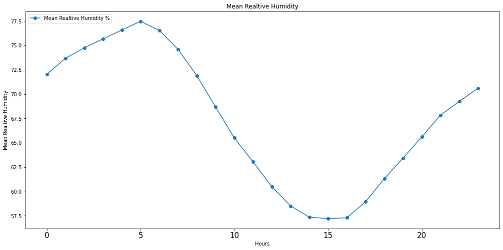
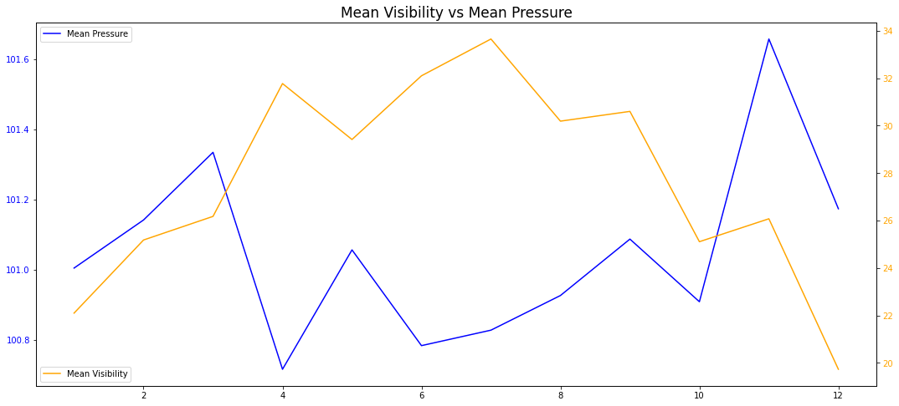
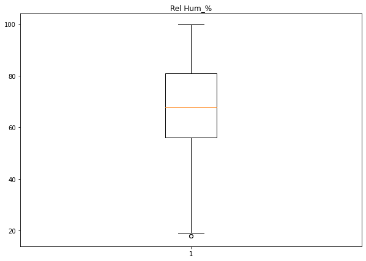

<h1 align="center">  Weather Data Analysis & Visualization </h1>

<h3 align="center"> ( Data From 2012 Jan To 2012 Dec ) </h3>


## Import Libararies

---


```python
# Import Libaraies

import pandas as pd
import numpy as np
import matplotlib.pyplot as plt
%matplotlib inline
import seaborn as sns

import warnings
warnings.filterwarnings("ignore")
```

## Getting know About The Dataset

---


```python
# import dataset
df = pd.read_csv('Weather Data.csv')
```


```python
# display first 5 rows of the dataset
df.head()
```


<div>
<style scoped>
    .dataframe tbody tr th:only-of-type {
        vertical-align: middle;
    }

    .dataframe tbody tr th {
        vertical-align: top;
    }

    .dataframe thead th {
        text-align: right;
    }
</style>
<table border="1" class="dataframe">
  <thead>
    <tr style="text-align: right;">
      <th></th>
      <th>Date/Time</th>
      <th>Temp_C</th>
      <th>Dew Point Temp_C</th>
      <th>Rel Hum_%</th>
      <th>Wind Speed_km/h</th>
      <th>Visibility_km</th>
      <th>Press_kPa</th>
      <th>Weather</th>
    </tr>
  </thead>
  <tbody>
    <tr>
      <th>0</th>
      <td>1/1/2012 0:00</td>
      <td>-1.8</td>
      <td>-3.9</td>
      <td>86</td>
      <td>4</td>
      <td>8.0</td>
      <td>101.24</td>
      <td>Fog</td>
    </tr>
    <tr>
      <th>1</th>
      <td>1/1/2012 1:00</td>
      <td>-1.8</td>
      <td>-3.7</td>
      <td>87</td>
      <td>4</td>
      <td>8.0</td>
      <td>101.24</td>
      <td>Fog</td>
    </tr>
    <tr>
      <th>2</th>
      <td>1/1/2012 2:00</td>
      <td>-1.8</td>
      <td>-3.4</td>
      <td>89</td>
      <td>7</td>
      <td>4.0</td>
      <td>101.26</td>
      <td>Freezing Drizzle,Fog</td>
    </tr>
    <tr>
      <th>3</th>
      <td>1/1/2012 3:00</td>
      <td>-1.5</td>
      <td>-3.2</td>
      <td>88</td>
      <td>6</td>
      <td>4.0</td>
      <td>101.27</td>
      <td>Freezing Drizzle,Fog</td>
    </tr>
    <tr>
      <th>4</th>
      <td>1/1/2012 4:00</td>
      <td>-1.5</td>
      <td>-3.3</td>
      <td>88</td>
      <td>7</td>
      <td>4.8</td>
      <td>101.23</td>
      <td>Fog</td>
    </tr>
  </tbody>
</table>
</div>


```python
# display the last 5 rows of the dataset
df.tail()
```


<div>
<style scoped>
    .dataframe tbody tr th:only-of-type {
        vertical-align: middle;
    }

    .dataframe tbody tr th {
        vertical-align: top;
    }

    .dataframe thead th {
        text-align: right;
    }
</style>
<table border="1" class="dataframe">
  <thead>
    <tr style="text-align: right;">
      <th></th>
      <th>Date/Time</th>
      <th>Temp_C</th>
      <th>Dew Point Temp_C</th>
      <th>Rel Hum_%</th>
      <th>Wind Speed_km/h</th>
      <th>Visibility_km</th>
      <th>Press_kPa</th>
      <th>Weather</th>
    </tr>
  </thead>
  <tbody>
    <tr>
      <th>8779</th>
      <td>12/31/2012 19:00</td>
      <td>0.1</td>
      <td>-2.7</td>
      <td>81</td>
      <td>30</td>
      <td>9.7</td>
      <td>100.13</td>
      <td>Snow</td>
    </tr>
    <tr>
      <th>8780</th>
      <td>12/31/2012 20:00</td>
      <td>0.2</td>
      <td>-2.4</td>
      <td>83</td>
      <td>24</td>
      <td>9.7</td>
      <td>100.03</td>
      <td>Snow</td>
    </tr>
    <tr>
      <th>8781</th>
      <td>12/31/2012 21:00</td>
      <td>-0.5</td>
      <td>-1.5</td>
      <td>93</td>
      <td>28</td>
      <td>4.8</td>
      <td>99.95</td>
      <td>Snow</td>
    </tr>
    <tr>
      <th>8782</th>
      <td>12/31/2012 22:00</td>
      <td>-0.2</td>
      <td>-1.8</td>
      <td>89</td>
      <td>28</td>
      <td>9.7</td>
      <td>99.91</td>
      <td>Snow</td>
    </tr>
    <tr>
      <th>8783</th>
      <td>12/31/2012 23:00</td>
      <td>0.0</td>
      <td>-2.1</td>
      <td>86</td>
      <td>30</td>
      <td>11.3</td>
      <td>99.89</td>
      <td>Snow</td>
    </tr>
  </tbody>
</table>
</div>


#### Number Of Records & Columns ( Features )


```python
# dataset shape ( rows & columns count)
df.shape
```


    (8784, 8)


> - There are 8784 Rows & 8 Columns

#### Number Of Index


```python
# index details about the dataset
df.index
```


    RangeIndex(start=0, stop=8784, step=1)


> - first index is : 0 
> - last index is  : 8784

#### Available Columns ( Features )


```python
# columns of the dataset
for i in df.columns:
    print(i)
```

    Date/Time
    Temp_C
    Dew Point Temp_C
    Rel Hum_%
    Wind Speed_km/h
    Visibility_km
    Press_kPa
    Weather
    

## Features In Details

---

### Temperature
- Temperature is a physical quantity that expresses hot and cold. It is the manifestation of thermal energy, present in all 
matter, which is the source of the occurrence of heat, a flow of energy, when a body is in contact with another that is colder
or hotter ( Mostly used Celsiuous as the measure ).

### Dew point Temperature
- Dew point temperature is defined as the temperature to which the air would have to cool (at constant pressure and constant water vapor content) in order to reach saturation ( Mostly used Celsiuous as the measure ).

### Relative Hamudity.
- Humidity is the concentration of water vapour present in the air. Water vapor, the gaseous state of water, is generally invisible to the human eye. ( Measure as % value )

### Wind Speed
- wind speed is a fundamental atmospheric quantity caused by air moving from high to low pressure (measured by Km/h )

### Visibility
- visibility is a measure of the distance at which an object or light can be clearly discerned. It depends only on the transparency of the surrounding air (Usualy Used Km as measure )

### Pressure
- Pressure is defined as the force divided by the area perpendicular to the force over which the force is applied. Kilopascal (kPa), one thousand times the unit of pressure and stress in the metre-kilogram-second system. ( usualy measured by kPa )


#### Available Date Range


```python
# minamum date
df['Date/Time'].max()
```


    '9/9/2012 9:00'


```python
# maximum date
df['Date/Time'].min()
```


    '1/1/2012 0:00'


```python
# getting know about 'Date/Time' Column
df['Date/Time'].head(25)
```


    0      1/1/2012 0:00
    1      1/1/2012 1:00
    2      1/1/2012 2:00
    3      1/1/2012 3:00
    4      1/1/2012 4:00
    5      1/1/2012 5:00
    6      1/1/2012 6:00
    7      1/1/2012 7:00
    8      1/1/2012 8:00
    9      1/1/2012 9:00
    10    1/1/2012 10:00
    11    1/1/2012 11:00
    12    1/1/2012 12:00
    13    1/1/2012 13:00
    14    1/1/2012 14:00
    15    1/1/2012 15:00
    16    1/1/2012 16:00
    17    1/1/2012 17:00
    18    1/1/2012 18:00
    19    1/1/2012 19:00
    20    1/1/2012 20:00
    21    1/1/2012 21:00
    22    1/1/2012 22:00
    23    1/1/2012 23:00
    24     1/2/2012 0:00
    Name: Date/Time, dtype: object


## Data Cleaning

---


```python
# data types of each columns
df.dtypes
```


    Date/Time            object
    Temp_C              float64
    Dew Point Temp_C    float64
    Rel Hum_%             int64
    Wind Speed_km/h       int64
    Visibility_km       float64
    Press_kPa           float64
    Weather              object
    dtype: object


```python
# Number of unique values in the dataset
df.nunique()
```


    Date/Time           8784
    Temp_C               533
    Dew Point Temp_C     489
    Rel Hum_%             83
    Wind Speed_km/h       34
    Visibility_km         24
    Press_kPa            518
    Weather               50
    dtype: int64


```python
# check the null value of the each columns
df.isnull().sum()
```


    Date/Time           0
    Temp_C              0
    Dew Point Temp_C    0
    Rel Hum_%           0
    Wind Speed_km/h     0
    Visibility_km       0
    Press_kPa           0
    Weather             0
    dtype: int64


```python
# change datatype of 'Date/Time' Column 
df['Date/Time'] = pd.to_datetime(df['Date/Time'])
```


```python
# check the result of above changes
df.dtypes
```


    Date/Time           datetime64[ns]
    Temp_C                     float64
    Dew Point Temp_C           float64
    Rel Hum_%                    int64
    Wind Speed_km/h              int64
    Visibility_km              float64
    Press_kPa                  float64
    Weather                     object
    dtype: object


```python
# Split Date & Time From Date/Time Column
df['Date'] = pd.to_datetime(df['Date/Time']).dt.date
df['Time'] = pd.to_datetime(df['Date/Time']).dt.time
```


```python
# split month from date
df['month'] = pd.to_datetime(df['Date']).dt.month
```


```python
# split hour from time
df['Hour'] = pd.to_datetime(df['Time'], format='%H:%M:%S').dt.hour
```


```python
# check The Above result
df.head()
```


<div>
<style scoped>
    .dataframe tbody tr th:only-of-type {
        vertical-align: middle;
    }

    .dataframe tbody tr th {
        vertical-align: top;
    }

    .dataframe thead th {
        text-align: right;
    }
</style>
<table border="1" class="dataframe">
  <thead>
    <tr style="text-align: right;">
      <th></th>
      <th>Date/Time</th>
      <th>Temp_C</th>
      <th>Dew Point Temp_C</th>
      <th>Rel Hum_%</th>
      <th>Wind Speed_km/h</th>
      <th>Visibility_km</th>
      <th>Press_kPa</th>
      <th>Weather</th>
      <th>Date</th>
      <th>Time</th>
      <th>month</th>
      <th>Hour</th>
    </tr>
  </thead>
  <tbody>
    <tr>
      <th>0</th>
      <td>2012-01-01 00:00:00</td>
      <td>-1.8</td>
      <td>-3.9</td>
      <td>86</td>
      <td>4</td>
      <td>8.0</td>
      <td>101.24</td>
      <td>Fog</td>
      <td>2012-01-01</td>
      <td>00:00:00</td>
      <td>1</td>
      <td>0</td>
    </tr>
    <tr>
      <th>1</th>
      <td>2012-01-01 01:00:00</td>
      <td>-1.8</td>
      <td>-3.7</td>
      <td>87</td>
      <td>4</td>
      <td>8.0</td>
      <td>101.24</td>
      <td>Fog</td>
      <td>2012-01-01</td>
      <td>01:00:00</td>
      <td>1</td>
      <td>1</td>
    </tr>
    <tr>
      <th>2</th>
      <td>2012-01-01 02:00:00</td>
      <td>-1.8</td>
      <td>-3.4</td>
      <td>89</td>
      <td>7</td>
      <td>4.0</td>
      <td>101.26</td>
      <td>Freezing Drizzle,Fog</td>
      <td>2012-01-01</td>
      <td>02:00:00</td>
      <td>1</td>
      <td>2</td>
    </tr>
    <tr>
      <th>3</th>
      <td>2012-01-01 03:00:00</td>
      <td>-1.5</td>
      <td>-3.2</td>
      <td>88</td>
      <td>6</td>
      <td>4.0</td>
      <td>101.27</td>
      <td>Freezing Drizzle,Fog</td>
      <td>2012-01-01</td>
      <td>03:00:00</td>
      <td>1</td>
      <td>3</td>
    </tr>
    <tr>
      <th>4</th>
      <td>2012-01-01 04:00:00</td>
      <td>-1.5</td>
      <td>-3.3</td>
      <td>88</td>
      <td>7</td>
      <td>4.8</td>
      <td>101.23</td>
      <td>Fog</td>
      <td>2012-01-01</td>
      <td>04:00:00</td>
      <td>1</td>
      <td>4</td>
    </tr>
  </tbody>
</table>
</div>


```python
# check conveted data types

df.dtypes
```


    Date/Time           datetime64[ns]
    Temp_C                     float64
    Dew Point Temp_C           float64
    Rel Hum_%                    int64
    Wind Speed_km/h              int64
    Visibility_km              float64
    Press_kPa                  float64
    Weather                     object
    Date                        object
    Time                        object
    month                        int64
    Hour                         int64
    dtype: object


## Exploratory Data Analysis & Visualization

---


```python
# display first 5 rows of cleaned data

df.head()
```


<div>
<style scoped>
    .dataframe tbody tr th:only-of-type {
        vertical-align: middle;
    }

    .dataframe tbody tr th {
        vertical-align: top;
    }

    .dataframe thead th {
        text-align: right;
    }
</style>
<table border="1" class="dataframe">
  <thead>
    <tr style="text-align: right;">
      <th></th>
      <th>Date/Time</th>
      <th>Temp_C</th>
      <th>Dew Point Temp_C</th>
      <th>Rel Hum_%</th>
      <th>Wind Speed_km/h</th>
      <th>Visibility_km</th>
      <th>Press_kPa</th>
      <th>Weather</th>
      <th>Date</th>
      <th>Time</th>
      <th>month</th>
      <th>Hour</th>
    </tr>
  </thead>
  <tbody>
    <tr>
      <th>0</th>
      <td>2012-01-01 00:00:00</td>
      <td>-1.8</td>
      <td>-3.9</td>
      <td>86</td>
      <td>4</td>
      <td>8.0</td>
      <td>101.24</td>
      <td>Fog</td>
      <td>2012-01-01</td>
      <td>00:00:00</td>
      <td>1</td>
      <td>0</td>
    </tr>
    <tr>
      <th>1</th>
      <td>2012-01-01 01:00:00</td>
      <td>-1.8</td>
      <td>-3.7</td>
      <td>87</td>
      <td>4</td>
      <td>8.0</td>
      <td>101.24</td>
      <td>Fog</td>
      <td>2012-01-01</td>
      <td>01:00:00</td>
      <td>1</td>
      <td>1</td>
    </tr>
    <tr>
      <th>2</th>
      <td>2012-01-01 02:00:00</td>
      <td>-1.8</td>
      <td>-3.4</td>
      <td>89</td>
      <td>7</td>
      <td>4.0</td>
      <td>101.26</td>
      <td>Freezing Drizzle,Fog</td>
      <td>2012-01-01</td>
      <td>02:00:00</td>
      <td>1</td>
      <td>2</td>
    </tr>
    <tr>
      <th>3</th>
      <td>2012-01-01 03:00:00</td>
      <td>-1.5</td>
      <td>-3.2</td>
      <td>88</td>
      <td>6</td>
      <td>4.0</td>
      <td>101.27</td>
      <td>Freezing Drizzle,Fog</td>
      <td>2012-01-01</td>
      <td>03:00:00</td>
      <td>1</td>
      <td>3</td>
    </tr>
    <tr>
      <th>4</th>
      <td>2012-01-01 04:00:00</td>
      <td>-1.5</td>
      <td>-3.3</td>
      <td>88</td>
      <td>7</td>
      <td>4.8</td>
      <td>101.23</td>
      <td>Fog</td>
      <td>2012-01-01</td>
      <td>04:00:00</td>
      <td>1</td>
      <td>4</td>
    </tr>
  </tbody>
</table>
</div>


```python
# Central Tendency Of The Selected Features

df[['Temp_C','Dew Point Temp_C','Rel Hum_%','Wind Speed_km/h','Visibility_km','Press_kPa']].describe()
```


<div>
<style scoped>
    .dataframe tbody tr th:only-of-type {
        vertical-align: middle;
    }

    .dataframe tbody tr th {
        vertical-align: top;
    }

    .dataframe thead th {
        text-align: right;
    }
</style>
<table border="1" class="dataframe">
  <thead>
    <tr style="text-align: right;">
      <th></th>
      <th>Temp_C</th>
      <th>Dew Point Temp_C</th>
      <th>Rel Hum_%</th>
      <th>Wind Speed_km/h</th>
      <th>Visibility_km</th>
      <th>Press_kPa</th>
    </tr>
  </thead>
  <tbody>
    <tr>
      <th>count</th>
      <td>8784.000000</td>
      <td>8784.000000</td>
      <td>8784.000000</td>
      <td>8784.000000</td>
      <td>8784.000000</td>
      <td>8784.000000</td>
    </tr>
    <tr>
      <th>mean</th>
      <td>8.798144</td>
      <td>2.555294</td>
      <td>67.431694</td>
      <td>14.945469</td>
      <td>27.664447</td>
      <td>101.051623</td>
    </tr>
    <tr>
      <th>std</th>
      <td>11.687883</td>
      <td>10.883072</td>
      <td>16.918881</td>
      <td>8.688696</td>
      <td>12.622688</td>
      <td>0.844005</td>
    </tr>
    <tr>
      <th>min</th>
      <td>-23.300000</td>
      <td>-28.500000</td>
      <td>18.000000</td>
      <td>0.000000</td>
      <td>0.200000</td>
      <td>97.520000</td>
    </tr>
    <tr>
      <th>25%</th>
      <td>0.100000</td>
      <td>-5.900000</td>
      <td>56.000000</td>
      <td>9.000000</td>
      <td>24.100000</td>
      <td>100.560000</td>
    </tr>
    <tr>
      <th>50%</th>
      <td>9.300000</td>
      <td>3.300000</td>
      <td>68.000000</td>
      <td>13.000000</td>
      <td>25.000000</td>
      <td>101.070000</td>
    </tr>
    <tr>
      <th>75%</th>
      <td>18.800000</td>
      <td>11.800000</td>
      <td>81.000000</td>
      <td>20.000000</td>
      <td>25.000000</td>
      <td>101.590000</td>
    </tr>
    <tr>
      <th>max</th>
      <td>33.000000</td>
      <td>24.400000</td>
      <td>100.000000</td>
      <td>83.000000</td>
      <td>48.300000</td>
      <td>103.650000</td>
    </tr>
  </tbody>
</table>
</div>


```python
#check the unique wheather situations available in the dataset
df['Weather'].unique()
```


    array(['Fog', 'Freezing Drizzle,Fog', 'Mostly Cloudy', 'Cloudy', 'Rain',
           'Rain Showers', 'Mainly Clear', 'Snow Showers', 'Snow', 'Clear',
           'Freezing Rain,Fog', 'Freezing Rain', 'Freezing Drizzle',
           'Rain,Snow', 'Moderate Snow', 'Freezing Drizzle,Snow',
           'Freezing Rain,Snow Grains', 'Snow,Blowing Snow', 'Freezing Fog',
           'Haze', 'Rain,Fog', 'Drizzle,Fog', 'Drizzle',
           'Freezing Drizzle,Haze', 'Freezing Rain,Haze', 'Snow,Haze',
           'Snow,Fog', 'Snow,Ice Pellets', 'Rain,Haze', 'Thunderstorms,Rain',
           'Thunderstorms,Rain Showers', 'Thunderstorms,Heavy Rain Showers',
           'Thunderstorms,Rain Showers,Fog', 'Thunderstorms',
           'Thunderstorms,Rain,Fog',
           'Thunderstorms,Moderate Rain Showers,Fog', 'Rain Showers,Fog',
           'Rain Showers,Snow Showers', 'Snow Pellets', 'Rain,Snow,Fog',
           'Moderate Rain,Fog', 'Freezing Rain,Ice Pellets,Fog',
           'Drizzle,Ice Pellets,Fog', 'Drizzle,Snow', 'Rain,Ice Pellets',
           'Drizzle,Snow,Fog', 'Rain,Snow Grains', 'Rain,Snow,Ice Pellets',
           'Snow Showers,Fog', 'Moderate Snow,Blowing Snow'], dtype=object)


```python
#check how many each weather types represented in the whole dataset
weather = {}

for i in df['Weather'].values:
    
        if str(i) in weather:           
            weather[str(i)] += 1
            
        else:
            weather[str(i)] = 1
            
Weather_df = pd.DataFrame(weather,index = ['Count'])
Weather_df = Weather_df.transpose()

Weather_df_tranpose = pd.DataFrame(Weather_df)
Weather_df_tranpose = Weather_df_tranpose.rename_axis(columns="Weather Type")

Weather_df_tranpose_sort = Weather_df_tranpose.sort_values('Count',ascending=False)
Weather_df_tranpose_sort
```


<div>
<style scoped>
    .dataframe tbody tr th:only-of-type {
        vertical-align: middle;
    }

    .dataframe tbody tr th {
        vertical-align: top;
    }

    .dataframe thead th {
        text-align: right;
    }
</style>
<table border="1" class="dataframe">
  <thead>
    <tr style="text-align: right;">
      <th>Weather Type</th>
      <th>Count</th>
    </tr>
  </thead>
  <tbody>
    <tr>
      <th>Mainly Clear</th>
      <td>2106</td>
    </tr>
    <tr>
      <th>Mostly Cloudy</th>
      <td>2069</td>
    </tr>
    <tr>
      <th>Cloudy</th>
      <td>1728</td>
    </tr>
    <tr>
      <th>Clear</th>
      <td>1326</td>
    </tr>
    <tr>
      <th>Snow</th>
      <td>390</td>
    </tr>
    <tr>
      <th>Rain</th>
      <td>306</td>
    </tr>
    <tr>
      <th>Rain Showers</th>
      <td>188</td>
    </tr>
    <tr>
      <th>Fog</th>
      <td>150</td>
    </tr>
    <tr>
      <th>Rain,Fog</th>
      <td>116</td>
    </tr>
    <tr>
      <th>Drizzle,Fog</th>
      <td>80</td>
    </tr>
    <tr>
      <th>Snow Showers</th>
      <td>60</td>
    </tr>
    <tr>
      <th>Drizzle</th>
      <td>41</td>
    </tr>
    <tr>
      <th>Snow,Fog</th>
      <td>37</td>
    </tr>
    <tr>
      <th>Snow,Blowing Snow</th>
      <td>19</td>
    </tr>
    <tr>
      <th>Rain,Snow</th>
      <td>18</td>
    </tr>
    <tr>
      <th>Thunderstorms,Rain Showers</th>
      <td>16</td>
    </tr>
    <tr>
      <th>Haze</th>
      <td>16</td>
    </tr>
    <tr>
      <th>Drizzle,Snow,Fog</th>
      <td>15</td>
    </tr>
    <tr>
      <th>Freezing Rain</th>
      <td>14</td>
    </tr>
    <tr>
      <th>Freezing Drizzle,Snow</th>
      <td>11</td>
    </tr>
    <tr>
      <th>Freezing Drizzle</th>
      <td>7</td>
    </tr>
    <tr>
      <th>Snow,Ice Pellets</th>
      <td>6</td>
    </tr>
    <tr>
      <th>Freezing Drizzle,Fog</th>
      <td>6</td>
    </tr>
    <tr>
      <th>Snow,Haze</th>
      <td>5</td>
    </tr>
    <tr>
      <th>Freezing Fog</th>
      <td>4</td>
    </tr>
    <tr>
      <th>Snow Showers,Fog</th>
      <td>4</td>
    </tr>
    <tr>
      <th>Moderate Snow</th>
      <td>4</td>
    </tr>
    <tr>
      <th>Rain,Snow,Ice Pellets</th>
      <td>4</td>
    </tr>
    <tr>
      <th>Freezing Rain,Fog</th>
      <td>4</td>
    </tr>
    <tr>
      <th>Freezing Drizzle,Haze</th>
      <td>3</td>
    </tr>
    <tr>
      <th>Rain,Haze</th>
      <td>3</td>
    </tr>
    <tr>
      <th>Thunderstorms,Rain</th>
      <td>3</td>
    </tr>
    <tr>
      <th>Thunderstorms,Rain Showers,Fog</th>
      <td>3</td>
    </tr>
    <tr>
      <th>Freezing Rain,Haze</th>
      <td>2</td>
    </tr>
    <tr>
      <th>Drizzle,Snow</th>
      <td>2</td>
    </tr>
    <tr>
      <th>Rain Showers,Snow Showers</th>
      <td>2</td>
    </tr>
    <tr>
      <th>Thunderstorms</th>
      <td>2</td>
    </tr>
    <tr>
      <th>Moderate Snow,Blowing Snow</th>
      <td>2</td>
    </tr>
    <tr>
      <th>Rain Showers,Fog</th>
      <td>1</td>
    </tr>
    <tr>
      <th>Thunderstorms,Moderate Rain Showers,Fog</th>
      <td>1</td>
    </tr>
    <tr>
      <th>Snow Pellets</th>
      <td>1</td>
    </tr>
    <tr>
      <th>Rain,Snow,Fog</th>
      <td>1</td>
    </tr>
    <tr>
      <th>Moderate Rain,Fog</th>
      <td>1</td>
    </tr>
    <tr>
      <th>Freezing Rain,Ice Pellets,Fog</th>
      <td>1</td>
    </tr>
    <tr>
      <th>Drizzle,Ice Pellets,Fog</th>
      <td>1</td>
    </tr>
    <tr>
      <th>Thunderstorms,Rain,Fog</th>
      <td>1</td>
    </tr>
    <tr>
      <th>Rain,Ice Pellets</th>
      <td>1</td>
    </tr>
    <tr>
      <th>Rain,Snow Grains</th>
      <td>1</td>
    </tr>
    <tr>
      <th>Thunderstorms,Heavy Rain Showers</th>
      <td>1</td>
    </tr>
    <tr>
      <th>Freezing Rain,Snow Grains</th>
      <td>1</td>
    </tr>
  </tbody>
</table>
</div>


```python
plt.figure(figsize=(18,8.5))
sns.countplot(df['Weather'],palette='husl')
plt.xticks(rotation='vertical',size=10)
plt.show()
```


    

    


### Group By Month Aggregated By Mean Values


```python
group_by_month = pd.DataFrame(df.groupby('month').mean().reset_index())
group_by_month
```


<div>
<style scoped>
    .dataframe tbody tr th:only-of-type {
        vertical-align: middle;
    }

    .dataframe tbody tr th {
        vertical-align: top;
    }

    .dataframe thead th {
        text-align: right;
    }
</style>
<table border="1" class="dataframe">
  <thead>
    <tr style="text-align: right;">
      <th></th>
      <th>month</th>
      <th>Temp_C</th>
      <th>Dew Point Temp_C</th>
      <th>Rel Hum_%</th>
      <th>Wind Speed_km/h</th>
      <th>Visibility_km</th>
      <th>Press_kPa</th>
      <th>Hour</th>
    </tr>
  </thead>
  <tbody>
    <tr>
      <th>0</th>
      <td>1</td>
      <td>-7.371505</td>
      <td>-12.294758</td>
      <td>68.383065</td>
      <td>18.108871</td>
      <td>22.100269</td>
      <td>101.005349</td>
      <td>11.5</td>
    </tr>
    <tr>
      <th>1</th>
      <td>2</td>
      <td>-4.225000</td>
      <td>-9.221695</td>
      <td>68.956897</td>
      <td>14.837644</td>
      <td>25.182184</td>
      <td>101.142414</td>
      <td>11.5</td>
    </tr>
    <tr>
      <th>2</th>
      <td>3</td>
      <td>3.121237</td>
      <td>-3.488575</td>
      <td>64.862903</td>
      <td>14.514785</td>
      <td>26.177957</td>
      <td>101.335255</td>
      <td>11.5</td>
    </tr>
    <tr>
      <th>3</th>
      <td>4</td>
      <td>7.009306</td>
      <td>-1.934583</td>
      <td>56.150000</td>
      <td>17.369444</td>
      <td>31.777083</td>
      <td>100.716833</td>
      <td>11.5</td>
    </tr>
    <tr>
      <th>4</th>
      <td>5</td>
      <td>16.237769</td>
      <td>8.080780</td>
      <td>61.760753</td>
      <td>12.846774</td>
      <td>29.418548</td>
      <td>101.057164</td>
      <td>11.5</td>
    </tr>
    <tr>
      <th>5</th>
      <td>6</td>
      <td>20.134028</td>
      <td>11.738056</td>
      <td>60.643056</td>
      <td>14.681944</td>
      <td>32.104167</td>
      <td>100.784222</td>
      <td>11.5</td>
    </tr>
    <tr>
      <th>6</th>
      <td>7</td>
      <td>22.790054</td>
      <td>14.595430</td>
      <td>62.017473</td>
      <td>11.887097</td>
      <td>33.655108</td>
      <td>100.828333</td>
      <td>11.5</td>
    </tr>
    <tr>
      <th>7</th>
      <td>8</td>
      <td>22.279301</td>
      <td>15.644758</td>
      <td>67.943548</td>
      <td>13.931452</td>
      <td>30.192608</td>
      <td>100.927097</td>
      <td>11.5</td>
    </tr>
    <tr>
      <th>8</th>
      <td>9</td>
      <td>16.484444</td>
      <td>10.757917</td>
      <td>71.165278</td>
      <td>14.108333</td>
      <td>30.603472</td>
      <td>101.087903</td>
      <td>11.5</td>
    </tr>
    <tr>
      <th>9</th>
      <td>10</td>
      <td>10.954973</td>
      <td>6.533468</td>
      <td>75.731183</td>
      <td>15.475806</td>
      <td>25.111022</td>
      <td>100.909368</td>
      <td>11.5</td>
    </tr>
    <tr>
      <th>10</th>
      <td>11</td>
      <td>0.931389</td>
      <td>-4.179306</td>
      <td>69.984722</td>
      <td>13.973611</td>
      <td>26.077083</td>
      <td>101.658306</td>
      <td>11.5</td>
    </tr>
    <tr>
      <th>11</th>
      <td>12</td>
      <td>-3.306317</td>
      <td>-6.129032</td>
      <td>81.299731</td>
      <td>17.614247</td>
      <td>19.733199</td>
      <td>101.174409</td>
      <td>11.5</td>
    </tr>
  </tbody>
</table>
</div>


### Group By Hours Of The Day Aggregated By Mean Value


```python
group_by_time = pd.DataFrame(df.groupby('Hour').mean().reset_index())
group_by_time.drop('month',axis='columns', inplace=True)

group_by_time
```


<div>
<style scoped>
    .dataframe tbody tr th:only-of-type {
        vertical-align: middle;
    }

    .dataframe tbody tr th {
        vertical-align: top;
    }

    .dataframe thead th {
        text-align: right;
    }
</style>
<table border="1" class="dataframe">
  <thead>
    <tr style="text-align: right;">
      <th></th>
      <th>Hour</th>
      <th>Temp_C</th>
      <th>Dew Point Temp_C</th>
      <th>Rel Hum_%</th>
      <th>Wind Speed_km/h</th>
      <th>Visibility_km</th>
      <th>Press_kPa</th>
    </tr>
  </thead>
  <tbody>
    <tr>
      <th>0</th>
      <td>0</td>
      <td>7.568579</td>
      <td>2.573224</td>
      <td>72.040984</td>
      <td>13.002732</td>
      <td>22.650546</td>
      <td>101.040492</td>
    </tr>
    <tr>
      <th>1</th>
      <td>1</td>
      <td>7.090437</td>
      <td>2.465847</td>
      <td>73.691257</td>
      <td>12.775956</td>
      <td>22.693989</td>
      <td>101.039180</td>
    </tr>
    <tr>
      <th>2</th>
      <td>2</td>
      <td>6.656011</td>
      <td>2.291803</td>
      <td>74.762295</td>
      <td>12.642077</td>
      <td>22.496175</td>
      <td>101.042760</td>
    </tr>
    <tr>
      <th>3</th>
      <td>3</td>
      <td>6.291803</td>
      <td>2.143716</td>
      <td>75.680328</td>
      <td>12.885246</td>
      <td>22.331694</td>
      <td>101.044399</td>
    </tr>
    <tr>
      <th>4</th>
      <td>4</td>
      <td>5.969126</td>
      <td>2.025137</td>
      <td>76.590164</td>
      <td>12.754098</td>
      <td>22.727322</td>
      <td>101.056175</td>
    </tr>
    <tr>
      <th>5</th>
      <td>5</td>
      <td>5.717760</td>
      <td>1.960929</td>
      <td>77.486339</td>
      <td>12.887978</td>
      <td>24.734153</td>
      <td>101.080519</td>
    </tr>
    <tr>
      <th>6</th>
      <td>6</td>
      <td>6.033060</td>
      <td>2.081148</td>
      <td>76.551913</td>
      <td>13.680328</td>
      <td>27.744536</td>
      <td>101.107842</td>
    </tr>
    <tr>
      <th>7</th>
      <td>7</td>
      <td>6.572951</td>
      <td>2.184426</td>
      <td>74.590164</td>
      <td>14.513661</td>
      <td>29.095082</td>
      <td>101.135410</td>
    </tr>
    <tr>
      <th>8</th>
      <td>8</td>
      <td>7.378142</td>
      <td>2.374590</td>
      <td>71.887978</td>
      <td>14.770492</td>
      <td>29.938798</td>
      <td>101.154617</td>
    </tr>
    <tr>
      <th>9</th>
      <td>9</td>
      <td>8.326230</td>
      <td>2.569672</td>
      <td>68.683060</td>
      <td>15.961749</td>
      <td>31.267760</td>
      <td>101.155109</td>
    </tr>
    <tr>
      <th>10</th>
      <td>10</td>
      <td>9.277596</td>
      <td>2.705738</td>
      <td>65.500000</td>
      <td>16.306011</td>
      <td>31.668033</td>
      <td>101.149208</td>
    </tr>
    <tr>
      <th>11</th>
      <td>11</td>
      <td>10.107650</td>
      <td>2.872131</td>
      <td>63.040984</td>
      <td>16.352459</td>
      <td>32.222678</td>
      <td>101.122650</td>
    </tr>
    <tr>
      <th>12</th>
      <td>12</td>
      <td>10.856557</td>
      <td>2.896448</td>
      <td>60.489071</td>
      <td>16.633880</td>
      <td>32.881967</td>
      <td>101.076448</td>
    </tr>
    <tr>
      <th>13</th>
      <td>13</td>
      <td>11.393716</td>
      <td>2.843989</td>
      <td>58.513661</td>
      <td>17.803279</td>
      <td>33.054645</td>
      <td>101.029344</td>
    </tr>
    <tr>
      <th>14</th>
      <td>14</td>
      <td>11.775956</td>
      <td>2.835246</td>
      <td>57.357923</td>
      <td>17.836066</td>
      <td>33.141803</td>
      <td>100.994945</td>
    </tr>
    <tr>
      <th>15</th>
      <td>15</td>
      <td>11.884153</td>
      <td>2.838798</td>
      <td>57.207650</td>
      <td>18.243169</td>
      <td>32.882514</td>
      <td>100.974126</td>
    </tr>
    <tr>
      <th>16</th>
      <td>16</td>
      <td>11.765574</td>
      <td>2.708743</td>
      <td>57.295082</td>
      <td>17.816940</td>
      <td>32.446721</td>
      <td>100.962240</td>
    </tr>
    <tr>
      <th>17</th>
      <td>17</td>
      <td>11.276503</td>
      <td>2.677049</td>
      <td>58.939891</td>
      <td>17.122951</td>
      <td>31.324863</td>
      <td>100.968005</td>
    </tr>
    <tr>
      <th>18</th>
      <td>18</td>
      <td>10.656284</td>
      <td>2.711202</td>
      <td>61.306011</td>
      <td>16.101093</td>
      <td>29.067213</td>
      <td>100.982787</td>
    </tr>
    <tr>
      <th>19</th>
      <td>19</td>
      <td>10.022951</td>
      <td>2.739344</td>
      <td>63.426230</td>
      <td>14.939891</td>
      <td>26.506284</td>
      <td>101.001803</td>
    </tr>
    <tr>
      <th>20</th>
      <td>20</td>
      <td>9.360109</td>
      <td>2.706284</td>
      <td>65.603825</td>
      <td>13.972678</td>
      <td>24.245628</td>
      <td>101.019536</td>
    </tr>
    <tr>
      <th>21</th>
      <td>21</td>
      <td>8.806557</td>
      <td>2.753005</td>
      <td>67.849727</td>
      <td>13.612022</td>
      <td>22.944536</td>
      <td>101.033033</td>
    </tr>
    <tr>
      <th>22</th>
      <td>22</td>
      <td>8.369399</td>
      <td>2.698087</td>
      <td>69.256831</td>
      <td>12.964481</td>
      <td>23.046448</td>
      <td>101.033115</td>
    </tr>
    <tr>
      <th>23</th>
      <td>23</td>
      <td>7.998361</td>
      <td>2.670492</td>
      <td>70.609290</td>
      <td>13.112022</td>
      <td>22.833333</td>
      <td>101.035219</td>
    </tr>
  </tbody>
</table>
</div>


## Temperature 

### Temperature Distribution Throughout The Year ( 2012 Jan - 2012 Dec )


```python
# Temperrature In 2012 To 2013

fig, ax = plt.subplots(1, 1, figsize=[18, 9.5])
ax.plot(df['Date'], df['Temp_C'])

plt.xlabel('Date',size=15)
plt.ylabel('Temperature In C',size=15)

plt.legend(['Temp In c'], loc=2)
ax.set_title('Temperature In 2012 - 2013',size=17)
```


    Text(0.5, 1.0, 'Temperature In 2012 - 2013')


    

    


### Maximum Temperature Detail

## Group By Weather Condition Aggregated By Mean


```python
# maximum temreture Detail

df[(df['Temp_C'] == df['Temp_C'].max())]
```


<div>
<style scoped>
    .dataframe tbody tr th:only-of-type {
        vertical-align: middle;
    }

    .dataframe tbody tr th {
        vertical-align: top;
    }

    .dataframe thead th {
        text-align: right;
    }
</style>
<table border="1" class="dataframe">
  <thead>
    <tr style="text-align: right;">
      <th></th>
      <th>Date/Time</th>
      <th>Temp_C</th>
      <th>Dew Point Temp_C</th>
      <th>Rel Hum_%</th>
      <th>Wind Speed_km/h</th>
      <th>Visibility_km</th>
      <th>Press_kPa</th>
      <th>Weather</th>
      <th>Date</th>
      <th>Time</th>
      <th>month</th>
      <th>Hour</th>
    </tr>
  </thead>
  <tbody>
    <tr>
      <th>4143</th>
      <td>2012-06-21 15:00:00</td>
      <td>33.0</td>
      <td>19.0</td>
      <td>44</td>
      <td>24</td>
      <td>24.1</td>
      <td>100.20</td>
      <td>Mainly Clear</td>
      <td>2012-06-21</td>
      <td>15:00:00</td>
      <td>6</td>
      <td>15</td>
    </tr>
    <tr>
      <th>4695</th>
      <td>2012-07-14 15:00:00</td>
      <td>33.0</td>
      <td>16.8</td>
      <td>38</td>
      <td>22</td>
      <td>48.3</td>
      <td>101.31</td>
      <td>Mainly Clear</td>
      <td>2012-07-14</td>
      <td>15:00:00</td>
      <td>7</td>
      <td>15</td>
    </tr>
  </tbody>
</table>
</div>


```python

```

### Minimum Temperature Details


```python
# minamum temreture Detail

df[(df['Temp_C'] == df['Temp_C'].min())]
```


<div>
<style scoped>
    .dataframe tbody tr th:only-of-type {
        vertical-align: middle;
    }

    .dataframe tbody tr th {
        vertical-align: top;
    }

    .dataframe thead th {
        text-align: right;
    }
</style>
<table border="1" class="dataframe">
  <thead>
    <tr style="text-align: right;">
      <th></th>
      <th>Date/Time</th>
      <th>Temp_C</th>
      <th>Dew Point Temp_C</th>
      <th>Rel Hum_%</th>
      <th>Wind Speed_km/h</th>
      <th>Visibility_km</th>
      <th>Press_kPa</th>
      <th>Weather</th>
      <th>Date</th>
      <th>Time</th>
      <th>month</th>
      <th>Hour</th>
    </tr>
  </thead>
  <tbody>
    <tr>
      <th>344</th>
      <td>2012-01-15 08:00:00</td>
      <td>-23.3</td>
      <td>-28.5</td>
      <td>62</td>
      <td>7</td>
      <td>24.1</td>
      <td>102.45</td>
      <td>Clear</td>
      <td>2012-01-15</td>
      <td>08:00:00</td>
      <td>1</td>
      <td>8</td>
    </tr>
  </tbody>
</table>
</div>


### Temperature Values Distribution Throughout The Year ( 2012 Jan - 2012 Dec )


```python
# Temperature Distribution

fig, ax = plt.subplots(1, 1, figsize = (20,10))
df['Temp_C'].hist(bins=30, ax=ax,histtype='bar')
plt.xlabel('Temp In C',fontsize=20)
plt.title('Temperature Distribution',fontsize=20)
plt.ylabel('Count',fontsize=20)
```


    Text(0, 0.5, 'Count')


    

    


### Visualize Mean Temperature In A Day


```python
# visulize mean temperature in a day
fig, ax = plt.subplots(figsize=(17, 8))

# Define x and y axes
ax.plot(group_by_time.Hour, 
        group_by_time.Temp_C,
        marker = 'o')

# Set plot title and axes labels
ax.set(title = " Mean Tempreture Distribution In A Day",
       xlabel = "Hours",
       ylabel = "Mean Tempreture")

# Set Legend
plt.legend(['Mean Temp In C'], loc=2)

# Set Axis Sixe
plt.xticks(size=15)

# Display the plot
plt.show()
```


    

    


### Visualize Mean Temperature By Months


```python
# visualize mean temperrature by months
fig, ax = plt.subplots(1, 1, figsize=[18, 8])
ax.plot(group_by_month['month'], group_by_month['Temp_C'])

plt.xlabel('Months',size=15)
plt.ylabel('Mean Temp',size=15)

plt.legend(['Mean Temp In C'], loc=2)
ax.set_title('Mean Temperature In Months',size=17)
```


    Text(0.5, 1.0, 'Mean Temperature In Months')


    

    


## Dew Point Temperature ( In C )

### Dew Point Temperature Distribution Throughout The Year ( 2012 Jan - 2012 Dec )


```python
# Dew Point Temperrature In 2012 To 2013

fig, ax = plt.subplots(1, 1, figsize=[18, 9.5])
ax.plot(df['Date'], df['Dew Point Temp_C'])

plt.xlabel('Date',size=15)
plt.ylabel('Dew Point Temp',size=15)

plt.legend(['Dew Point Temp In C'], loc=2)
ax.set_title('Temperature Throughout The Year ( 2012 Jan - 2012 Dec )',size=17)
```


    Text(0.5, 1.0, 'Temperature Throughout The Year ( 2012 Jan - 2012 Dec )')


    

    


### Maximum Dew Point Temperature Detail


```python
# maximum Dew Point temreture Detail

df[(df['Dew Point Temp_C'] == df['Dew Point Temp_C'].max())]
```


<div>
<style scoped>
    .dataframe tbody tr th:only-of-type {
        vertical-align: middle;
    }

    .dataframe tbody tr th {
        vertical-align: top;
    }

    .dataframe thead th {
        text-align: right;
    }
</style>
<table border="1" class="dataframe">
  <thead>
    <tr style="text-align: right;">
      <th></th>
      <th>Date/Time</th>
      <th>Temp_C</th>
      <th>Dew Point Temp_C</th>
      <th>Rel Hum_%</th>
      <th>Wind Speed_km/h</th>
      <th>Visibility_km</th>
      <th>Press_kPa</th>
      <th>Weather</th>
      <th>Date</th>
      <th>Time</th>
      <th>month</th>
      <th>Hour</th>
    </tr>
  </thead>
  <tbody>
    <tr>
      <th>5223</th>
      <td>2012-08-05 15:00:00</td>
      <td>29.0</td>
      <td>24.4</td>
      <td>76</td>
      <td>13</td>
      <td>24.1</td>
      <td>100.31</td>
      <td>Mostly Cloudy</td>
      <td>2012-08-05</td>
      <td>15:00:00</td>
      <td>8</td>
      <td>15</td>
    </tr>
  </tbody>
</table>
</div>


### Minimam Dew Point Temperature Detail


```python
# minimum Dew Point temreture Detail

df[(df['Dew Point Temp_C'] == df['Dew Point Temp_C'].min())]
```


<div>
<style scoped>
    .dataframe tbody tr th:only-of-type {
        vertical-align: middle;
    }

    .dataframe tbody tr th {
        vertical-align: top;
    }

    .dataframe thead th {
        text-align: right;
    }
</style>
<table border="1" class="dataframe">
  <thead>
    <tr style="text-align: right;">
      <th></th>
      <th>Date/Time</th>
      <th>Temp_C</th>
      <th>Dew Point Temp_C</th>
      <th>Rel Hum_%</th>
      <th>Wind Speed_km/h</th>
      <th>Visibility_km</th>
      <th>Press_kPa</th>
      <th>Weather</th>
      <th>Date</th>
      <th>Time</th>
      <th>month</th>
      <th>Hour</th>
    </tr>
  </thead>
  <tbody>
    <tr>
      <th>342</th>
      <td>2012-01-15 06:00:00</td>
      <td>-23.2</td>
      <td>-28.5</td>
      <td>62</td>
      <td>7</td>
      <td>25.0</td>
      <td>102.28</td>
      <td>Mostly Cloudy</td>
      <td>2012-01-15</td>
      <td>06:00:00</td>
      <td>1</td>
      <td>6</td>
    </tr>
    <tr>
      <th>344</th>
      <td>2012-01-15 08:00:00</td>
      <td>-23.3</td>
      <td>-28.5</td>
      <td>62</td>
      <td>7</td>
      <td>24.1</td>
      <td>102.45</td>
      <td>Clear</td>
      <td>2012-01-15</td>
      <td>08:00:00</td>
      <td>1</td>
      <td>8</td>
    </tr>
  </tbody>
</table>
</div>


### Dew Point Temperature Distribution


```python
# Temperature Distribution

fig, ax = plt.subplots(1, 1, figsize = (20,10))
df['Dew Point Temp_C'].hist(bins=30, ax=ax,histtype='bar')
plt.xlabel('Dew Temp In C',fontsize=20)
plt.title('Dew Point Temperature Distribution',fontsize=20)
plt.ylabel('Count',fontsize=20)
```


    Text(0, 0.5, 'Count')


    

    


### Visualize Mean Dew Point Tempreture In A Day


```python
# visulize Mean Dew Point Tempreture in a day
fig, ax = plt.subplots(figsize=(17, 8))

# Define x and y axes
ax.plot(group_by_time.Hour, 
        group_by_time['Dew Point Temp_C'],
        marker = 'o')

# Set plot title and axes labels
ax.set(title = " Mean Dew Point Tempreture Distribution In A Day",
       xlabel = "Hours",
       ylabel = "Mean Dew Point Temp")

# Set Legend
plt.legend(['Mean Dew Point Temp In C'], loc=2)

# Set Axis Sixe
plt.xticks(size=15)

# Display the plot
plt.show()
```


    

    


### Visualize Mean Dew Point Temperature By Months


```python
# visualize mean temperrature by months
fig, ax = plt.subplots(1, 1, figsize=[18, 8])
ax.plot(group_by_month['month'], group_by_month['Dew Point Temp_C'])

plt.xlabel('Months',size=15)
plt.ylabel('Mean Dew Point Temp',size=15)

plt.legend(['Mean Dew Point Temp In C'], loc=2)
ax.set_title('Mean Dew Point Temperature In Months',size=17)
```


    Text(0.5, 1.0, 'Mean Dew Point Temperature In Months')


    

    


## Relative Humudity

### Relative Humudity Throughout The Year ( 2012 Jan - 2012 Dec )


```python
# Relative Humudity In 2012 To 2013

fig, ax = plt.subplots(1, 1, figsize=[18, 9.5])
ax.plot(df['Date'], df['Rel Hum_%'])

plt.xlabel('Date',size=15)
plt.ylabel('Relative Humudity %',size=15)

plt.legend(['Relative Humudity %'], loc=2)
ax.set_title('Relative Humudity Throughout The Year ( 2012 Jan - 2012 Dec )',size=17)
```


    Text(0.5, 1.0, 'Relative Humudity Throughout The Year ( 2012 Jan - 2012 Dec )')


    

    


### Maximum Relative Humidity Detail


```python
# maximum Dew Point temreture Detail

df[(df['Rel Hum_%'] == df['Rel Hum_%'].max())]
```


<div>
<style scoped>
    .dataframe tbody tr th:only-of-type {
        vertical-align: middle;
    }

    .dataframe tbody tr th {
        vertical-align: top;
    }

    .dataframe thead th {
        text-align: right;
    }
</style>
<table border="1" class="dataframe">
  <thead>
    <tr style="text-align: right;">
      <th></th>
      <th>Date/Time</th>
      <th>Temp_C</th>
      <th>Dew Point Temp_C</th>
      <th>Rel Hum_%</th>
      <th>Wind Speed_km/h</th>
      <th>Visibility_km</th>
      <th>Press_kPa</th>
      <th>Weather</th>
      <th>Date</th>
      <th>Time</th>
      <th>month</th>
      <th>Hour</th>
    </tr>
  </thead>
  <tbody>
    <tr>
      <th>1834</th>
      <td>2012-03-17 10:00:00</td>
      <td>2.6</td>
      <td>2.6</td>
      <td>100</td>
      <td>0</td>
      <td>0.2</td>
      <td>102.37</td>
      <td>Fog</td>
      <td>2012-03-17</td>
      <td>10:00:00</td>
      <td>3</td>
      <td>10</td>
    </tr>
    <tr>
      <th>6572</th>
      <td>2012-09-30 20:00:00</td>
      <td>11.6</td>
      <td>11.6</td>
      <td>100</td>
      <td>9</td>
      <td>8.0</td>
      <td>100.00</td>
      <td>Rain,Fog</td>
      <td>2012-09-30</td>
      <td>20:00:00</td>
      <td>9</td>
      <td>20</td>
    </tr>
    <tr>
      <th>6606</th>
      <td>2012-10-02 06:00:00</td>
      <td>11.2</td>
      <td>11.2</td>
      <td>100</td>
      <td>0</td>
      <td>48.3</td>
      <td>100.96</td>
      <td>Mostly Cloudy</td>
      <td>2012-10-02</td>
      <td>06:00:00</td>
      <td>10</td>
      <td>6</td>
    </tr>
    <tr>
      <th>6629</th>
      <td>2012-10-03 05:00:00</td>
      <td>11.0</td>
      <td>11.0</td>
      <td>100</td>
      <td>11</td>
      <td>3.2</td>
      <td>101.38</td>
      <td>Fog</td>
      <td>2012-10-03</td>
      <td>05:00:00</td>
      <td>10</td>
      <td>5</td>
    </tr>
    <tr>
      <th>6630</th>
      <td>2012-10-03 06:00:00</td>
      <td>11.5</td>
      <td>11.5</td>
      <td>100</td>
      <td>11</td>
      <td>0.6</td>
      <td>101.42</td>
      <td>Fog</td>
      <td>2012-10-03</td>
      <td>06:00:00</td>
      <td>10</td>
      <td>6</td>
    </tr>
    <tr>
      <th>6631</th>
      <td>2012-10-03 07:00:00</td>
      <td>11.7</td>
      <td>11.7</td>
      <td>100</td>
      <td>13</td>
      <td>0.6</td>
      <td>101.49</td>
      <td>Fog</td>
      <td>2012-10-03</td>
      <td>07:00:00</td>
      <td>10</td>
      <td>7</td>
    </tr>
    <tr>
      <th>6632</th>
      <td>2012-10-03 08:00:00</td>
      <td>11.4</td>
      <td>11.4</td>
      <td>100</td>
      <td>15</td>
      <td>1.6</td>
      <td>101.54</td>
      <td>Fog</td>
      <td>2012-10-03</td>
      <td>08:00:00</td>
      <td>10</td>
      <td>8</td>
    </tr>
    <tr>
      <th>6668</th>
      <td>2012-10-04 20:00:00</td>
      <td>14.1</td>
      <td>14.1</td>
      <td>100</td>
      <td>4</td>
      <td>9.7</td>
      <td>101.10</td>
      <td>Fog</td>
      <td>2012-10-04</td>
      <td>20:00:00</td>
      <td>10</td>
      <td>20</td>
    </tr>
    <tr>
      <th>7038</th>
      <td>2012-10-20 06:00:00</td>
      <td>10.6</td>
      <td>10.6</td>
      <td>100</td>
      <td>4</td>
      <td>0.4</td>
      <td>99.87</td>
      <td>Fog</td>
      <td>2012-10-20</td>
      <td>06:00:00</td>
      <td>10</td>
      <td>6</td>
    </tr>
    <tr>
      <th>8083</th>
      <td>2012-12-02 19:00:00</td>
      <td>5.9</td>
      <td>5.9</td>
      <td>100</td>
      <td>15</td>
      <td>3.6</td>
      <td>100.67</td>
      <td>Drizzle,Fog</td>
      <td>2012-12-02</td>
      <td>19:00:00</td>
      <td>12</td>
      <td>19</td>
    </tr>
  </tbody>
</table>
</div>


### Minimum Relative Humidity Detail


```python
# Minimum Dew Point temreture Detail

df[(df['Rel Hum_%'] == df['Rel Hum_%'].min())]
```


<div>
<style scoped>
    .dataframe tbody tr th:only-of-type {
        vertical-align: middle;
    }

    .dataframe tbody tr th {
        vertical-align: top;
    }

    .dataframe thead th {
        text-align: right;
    }
</style>
<table border="1" class="dataframe">
  <thead>
    <tr style="text-align: right;">
      <th></th>
      <th>Date/Time</th>
      <th>Temp_C</th>
      <th>Dew Point Temp_C</th>
      <th>Rel Hum_%</th>
      <th>Wind Speed_km/h</th>
      <th>Visibility_km</th>
      <th>Press_kPa</th>
      <th>Weather</th>
      <th>Date</th>
      <th>Time</th>
      <th>month</th>
      <th>Hour</th>
    </tr>
  </thead>
  <tbody>
    <tr>
      <th>1984</th>
      <td>2012-03-23 16:00:00</td>
      <td>15.5</td>
      <td>-9.0</td>
      <td>18</td>
      <td>22</td>
      <td>48.3</td>
      <td>101.6</td>
      <td>Cloudy</td>
      <td>2012-03-23</td>
      <td>16:00:00</td>
      <td>3</td>
      <td>16</td>
    </tr>
    <tr>
      <th>3066</th>
      <td>2012-05-07 18:00:00</td>
      <td>20.7</td>
      <td>-4.4</td>
      <td>18</td>
      <td>13</td>
      <td>48.3</td>
      <td>101.0</td>
      <td>Mostly Cloudy</td>
      <td>2012-05-07</td>
      <td>18:00:00</td>
      <td>5</td>
      <td>18</td>
    </tr>
  </tbody>
</table>
</div>


### Relative Humidity Distribution


```python
# Relative Humidity Distribution

fig, ax = plt.subplots(1, 1, figsize = (20,10))
df['Rel Hum_%'].hist(bins=30, ax=ax,histtype='bar')
plt.xlabel('Relative Humidity %',fontsize=20)
plt.title('Relative Humidity',fontsize=20)
plt.ylabel('Count',fontsize=20)
```


    Text(0, 0.5, 'Count')


    

    


### Visualize Mean Realtive Humidity % In Day


```python
# visulize Mean Dew Point Tempreture in a day
fig, ax = plt.subplots(figsize=(17, 8))

# Define x and y axes
ax.plot(group_by_time.Hour, 
        group_by_time['Rel Hum_%'],
        marker = 'o')

# Set plot title and axes labels
ax.set(title = "Mean Realtive Humidity",
       xlabel = "Hours",
       ylabel = "Mean Realtive Humidity")

# Set Legend
plt.legend(['Mean Realtive Humidity %'], loc=2)

# Set Axis Sixe
plt.xticks(size=15)

# Display the plot
plt.show()
```


    

    


### Visualize Mean Realtive Humidity % By Months


```python
# visualize Mean Realtive Humidity by months
fig, ax = plt.subplots(1, 1, figsize=[18, 8])
ax.plot(group_by_month['month'], group_by_month['Rel Hum_%'])

plt.xlabel('Months',size=15)
plt.ylabel('Mean Retive Humidity %',size=15)

plt.legend(['Mean Retive Humidity %'], loc=2)
ax.set_title('Mean Retive Humidity % In Months',size=17)
```


    Text(0.5, 1.0, 'Mean Retive Humidity % In Months')


    

    


## Wind Speed

### Wind Speed Throughout The Year ( 2012 Jan - 2012 Dec )


```python
# Relative Humudity In 2012 To 2013

fig, ax = plt.subplots(1, 1, figsize=[18, 9.5])
ax.plot(df['Date'], df['Wind Speed_km/h'])

plt.xlabel('Date',size=15)
plt.ylabel('Wind Speed_km/h',size=15)

plt.legend(['Wind Speed_km/h'], loc=2)
ax.set_title('Wind Speed_km/h Throughout The Year ( 2012 Jan - 2012 Dec )',size=17)
```


    Text(0.5, 1.0, 'Wind Speed_km/h Throughout The Year ( 2012 Jan - 2012 Dec )')


    

    


### Maximum Wind Speed Detail


```python
# Maximum Dew Point temreture Detail

df[(df['Wind Speed_km/h'] == df['Wind Speed_km/h'].max())]
```


<div>
<style scoped>
    .dataframe tbody tr th:only-of-type {
        vertical-align: middle;
    }

    .dataframe tbody tr th {
        vertical-align: top;
    }

    .dataframe thead th {
        text-align: right;
    }
</style>
<table border="1" class="dataframe">
  <thead>
    <tr style="text-align: right;">
      <th></th>
      <th>Date/Time</th>
      <th>Temp_C</th>
      <th>Dew Point Temp_C</th>
      <th>Rel Hum_%</th>
      <th>Wind Speed_km/h</th>
      <th>Visibility_km</th>
      <th>Press_kPa</th>
      <th>Weather</th>
      <th>Date</th>
      <th>Time</th>
      <th>month</th>
      <th>Hour</th>
    </tr>
  </thead>
  <tbody>
    <tr>
      <th>409</th>
      <td>2012-01-18 01:00:00</td>
      <td>3.7</td>
      <td>-2.1</td>
      <td>66</td>
      <td>83</td>
      <td>25.0</td>
      <td>98.36</td>
      <td>Mostly Cloudy</td>
      <td>2012-01-18</td>
      <td>01:00:00</td>
      <td>1</td>
      <td>1</td>
    </tr>
  </tbody>
</table>
</div>


### Minimum Wind Speed Detail


```python
# Minimum Dew Point temreture Detail

df[(df['Wind Speed_km/h'] == df['Wind Speed_km/h'].min())]
```


<div>
<style scoped>
    .dataframe tbody tr th:only-of-type {
        vertical-align: middle;
    }

    .dataframe tbody tr th {
        vertical-align: top;
    }

    .dataframe thead th {
        text-align: right;
    }
</style>
<table border="1" class="dataframe">
  <thead>
    <tr style="text-align: right;">
      <th></th>
      <th>Date/Time</th>
      <th>Temp_C</th>
      <th>Dew Point Temp_C</th>
      <th>Rel Hum_%</th>
      <th>Wind Speed_km/h</th>
      <th>Visibility_km</th>
      <th>Press_kPa</th>
      <th>Weather</th>
      <th>Date</th>
      <th>Time</th>
      <th>month</th>
      <th>Hour</th>
    </tr>
  </thead>
  <tbody>
    <tr>
      <th>97</th>
      <td>2012-01-05 01:00:00</td>
      <td>-7.5</td>
      <td>-10.2</td>
      <td>81</td>
      <td>0</td>
      <td>9.7</td>
      <td>100.29</td>
      <td>Snow</td>
      <td>2012-01-05</td>
      <td>01:00:00</td>
      <td>1</td>
      <td>1</td>
    </tr>
    <tr>
      <th>123</th>
      <td>2012-01-06 03:00:00</td>
      <td>-10.6</td>
      <td>-16.0</td>
      <td>64</td>
      <td>0</td>
      <td>9.7</td>
      <td>100.76</td>
      <td>Snow</td>
      <td>2012-01-06</td>
      <td>03:00:00</td>
      <td>1</td>
      <td>3</td>
    </tr>
    <tr>
      <th>145</th>
      <td>2012-01-07 01:00:00</td>
      <td>-8.5</td>
      <td>-11.4</td>
      <td>80</td>
      <td>0</td>
      <td>19.3</td>
      <td>100.11</td>
      <td>Cloudy</td>
      <td>2012-01-07</td>
      <td>01:00:00</td>
      <td>1</td>
      <td>1</td>
    </tr>
    <tr>
      <th>160</th>
      <td>2012-01-07 16:00:00</td>
      <td>-3.6</td>
      <td>-5.9</td>
      <td>84</td>
      <td>0</td>
      <td>8.0</td>
      <td>100.15</td>
      <td>Snow</td>
      <td>2012-01-07</td>
      <td>16:00:00</td>
      <td>1</td>
      <td>16</td>
    </tr>
    <tr>
      <th>165</th>
      <td>2012-01-07 21:00:00</td>
      <td>-1.3</td>
      <td>-3.1</td>
      <td>88</td>
      <td>0</td>
      <td>6.4</td>
      <td>100.50</td>
      <td>Snow</td>
      <td>2012-01-07</td>
      <td>21:00:00</td>
      <td>1</td>
      <td>21</td>
    </tr>
    <tr>
      <th>...</th>
      <td>...</td>
      <td>...</td>
      <td>...</td>
      <td>...</td>
      <td>...</td>
      <td>...</td>
      <td>...</td>
      <td>...</td>
      <td>...</td>
      <td>...</td>
      <td>...</td>
      <td>...</td>
    </tr>
    <tr>
      <th>7942</th>
      <td>2012-11-26 22:00:00</td>
      <td>-5.4</td>
      <td>-9.6</td>
      <td>72</td>
      <td>0</td>
      <td>25.0</td>
      <td>101.90</td>
      <td>Clear</td>
      <td>2012-11-26</td>
      <td>22:00:00</td>
      <td>11</td>
      <td>22</td>
    </tr>
    <tr>
      <th>8028</th>
      <td>2012-11-30 12:00:00</td>
      <td>-9.3</td>
      <td>-15.2</td>
      <td>62</td>
      <td>0</td>
      <td>48.3</td>
      <td>103.16</td>
      <td>Mostly Cloudy</td>
      <td>2012-11-30</td>
      <td>12:00:00</td>
      <td>11</td>
      <td>12</td>
    </tr>
    <tr>
      <th>8108</th>
      <td>2012-12-03 20:00:00</td>
      <td>3.5</td>
      <td>0.7</td>
      <td>82</td>
      <td>0</td>
      <td>25.0</td>
      <td>101.99</td>
      <td>Cloudy</td>
      <td>2012-12-03</td>
      <td>20:00:00</td>
      <td>12</td>
      <td>20</td>
    </tr>
    <tr>
      <th>8212</th>
      <td>2012-12-08 04:00:00</td>
      <td>2.5</td>
      <td>-1.2</td>
      <td>77</td>
      <td>0</td>
      <td>25.0</td>
      <td>101.13</td>
      <td>Cloudy</td>
      <td>2012-12-08</td>
      <td>04:00:00</td>
      <td>12</td>
      <td>4</td>
    </tr>
    <tr>
      <th>8767</th>
      <td>2012-12-31 07:00:00</td>
      <td>-9.3</td>
      <td>-11.3</td>
      <td>85</td>
      <td>0</td>
      <td>19.3</td>
      <td>101.19</td>
      <td>Snow Showers</td>
      <td>2012-12-31</td>
      <td>07:00:00</td>
      <td>12</td>
      <td>7</td>
    </tr>
  </tbody>
</table>
<p>309 rows  12 columns</p>
</div>


### Wind Speed Distribution


```python
# Wind Speed Distribution

fig, ax = plt.subplots(1, 1, figsize = (20,10))
df['Wind Speed_km/h'].hist(bins=30, ax=ax,histtype='bar')
plt.xlabel('Wind Speed_km/h',fontsize=20)
plt.title('Wind Speed',fontsize=20)
plt.ylabel('Count',fontsize=20)
```


    Text(0, 0.5, 'Count')


    

    


### Visualize Mean Wind Speed Km/h In Day


```python
# visulize mean Wind Speed Km/h in a day
fig, ax = plt.subplots(figsize=(17, 8))

# Define x and y axes
ax.plot(group_by_time.Hour, 
        group_by_time['Wind Speed_km/h'],
        marker = 'o')

# Set plot title and axes labels
ax.set(title = "Mean Wind Speed Km/h In Day",
       xlabel = "Hours",
       ylabel = "Mean Wind Speed Km/h")

# Set Legend
plt.legend(['Mean Wind Speed Km/h'], loc=2)

# Set Axis Sixe
plt.xticks(size=15)

# Display the plot
plt.show()
```


    

    


### Visualize Mean Wind Speed In Year


```python
# visualize Mean Wind Speed Km/h In Year
fig, ax = plt.subplots(1, 1, figsize=[18, 8])
ax.plot(group_by_month['month'], group_by_month['Wind Speed_km/h'])

plt.xlabel('Months',size=15)
plt.ylabel('Mean Wind Speed km/h',size=15)

plt.legend(['Mean Wind Speed In km/h'], loc=2)
ax.set_title('Mean Wind Speed In Months',size=17)
```


    Text(0.5, 1.0, 'Mean Wind Speed In Months')


    

    


## Visibility

### Visibility Throughout The Year ( 2012 Jan - 2012 Dec )


```python
# Visibility In 2012 To 2013

fig, ax = plt.subplots(1, 1, figsize=[18, 9.5])
ax.plot(df['Date'], df['Visibility_km'])

plt.xlabel('Date',size=15)
plt.ylabel('Visibility (km)',size=15)

plt.legend(['Visibility (km)'], loc=2)
ax.set_title('Visibility Throughout The Year ( 2012 Jan - 2012 Dec )',size=17)
```


    Text(0.5, 1.0, 'Visibility Throughout The Year ( 2012 Jan - 2012 Dec )')


    

    


### Maximum Visibility Detail


```python
# Maximum Visibility Detail

df[(df['Visibility_km'] == df['Visibility_km'].max())]
```


<div>
<style scoped>
    .dataframe tbody tr th:only-of-type {
        vertical-align: middle;
    }

    .dataframe tbody tr th {
        vertical-align: top;
    }

    .dataframe thead th {
        text-align: right;
    }
</style>
<table border="1" class="dataframe">
  <thead>
    <tr style="text-align: right;">
      <th></th>
      <th>Date/Time</th>
      <th>Temp_C</th>
      <th>Dew Point Temp_C</th>
      <th>Rel Hum_%</th>
      <th>Wind Speed_km/h</th>
      <th>Visibility_km</th>
      <th>Press_kPa</th>
      <th>Weather</th>
      <th>Date</th>
      <th>Time</th>
      <th>month</th>
      <th>Hour</th>
    </tr>
  </thead>
  <tbody>
    <tr>
      <th>106</th>
      <td>2012-01-05 10:00:00</td>
      <td>-6.0</td>
      <td>-10.0</td>
      <td>73</td>
      <td>17</td>
      <td>48.3</td>
      <td>100.45</td>
      <td>Mainly Clear</td>
      <td>2012-01-05</td>
      <td>10:00:00</td>
      <td>1</td>
      <td>10</td>
    </tr>
    <tr>
      <th>107</th>
      <td>2012-01-05 11:00:00</td>
      <td>-5.6</td>
      <td>-10.2</td>
      <td>70</td>
      <td>22</td>
      <td>48.3</td>
      <td>100.41</td>
      <td>Mainly Clear</td>
      <td>2012-01-05</td>
      <td>11:00:00</td>
      <td>1</td>
      <td>11</td>
    </tr>
    <tr>
      <th>108</th>
      <td>2012-01-05 12:00:00</td>
      <td>-4.7</td>
      <td>-9.6</td>
      <td>69</td>
      <td>20</td>
      <td>48.3</td>
      <td>100.38</td>
      <td>Mainly Clear</td>
      <td>2012-01-05</td>
      <td>12:00:00</td>
      <td>1</td>
      <td>12</td>
    </tr>
    <tr>
      <th>109</th>
      <td>2012-01-05 13:00:00</td>
      <td>-4.4</td>
      <td>-9.7</td>
      <td>66</td>
      <td>26</td>
      <td>48.3</td>
      <td>100.40</td>
      <td>Mainly Clear</td>
      <td>2012-01-05</td>
      <td>13:00:00</td>
      <td>1</td>
      <td>13</td>
    </tr>
    <tr>
      <th>110</th>
      <td>2012-01-05 14:00:00</td>
      <td>-5.1</td>
      <td>-10.7</td>
      <td>65</td>
      <td>22</td>
      <td>48.3</td>
      <td>100.46</td>
      <td>Mainly Clear</td>
      <td>2012-01-05</td>
      <td>14:00:00</td>
      <td>1</td>
      <td>14</td>
    </tr>
    <tr>
      <th>...</th>
      <td>...</td>
      <td>...</td>
      <td>...</td>
      <td>...</td>
      <td>...</td>
      <td>...</td>
      <td>...</td>
      <td>...</td>
      <td>...</td>
      <td>...</td>
      <td>...</td>
      <td>...</td>
    </tr>
    <tr>
      <th>8748</th>
      <td>2012-12-30 12:00:00</td>
      <td>-12.2</td>
      <td>-15.7</td>
      <td>75</td>
      <td>26</td>
      <td>48.3</td>
      <td>100.91</td>
      <td>Mostly Cloudy</td>
      <td>2012-12-30</td>
      <td>12:00:00</td>
      <td>12</td>
      <td>12</td>
    </tr>
    <tr>
      <th>8749</th>
      <td>2012-12-30 13:00:00</td>
      <td>-12.4</td>
      <td>-16.2</td>
      <td>73</td>
      <td>37</td>
      <td>48.3</td>
      <td>100.92</td>
      <td>Mostly Cloudy</td>
      <td>2012-12-30</td>
      <td>13:00:00</td>
      <td>12</td>
      <td>13</td>
    </tr>
    <tr>
      <th>8750</th>
      <td>2012-12-30 14:00:00</td>
      <td>-11.8</td>
      <td>-16.1</td>
      <td>70</td>
      <td>37</td>
      <td>48.3</td>
      <td>100.96</td>
      <td>Mainly Clear</td>
      <td>2012-12-30</td>
      <td>14:00:00</td>
      <td>12</td>
      <td>14</td>
    </tr>
    <tr>
      <th>8751</th>
      <td>2012-12-30 15:00:00</td>
      <td>-11.3</td>
      <td>-15.6</td>
      <td>70</td>
      <td>32</td>
      <td>48.3</td>
      <td>101.05</td>
      <td>Mainly Clear</td>
      <td>2012-12-30</td>
      <td>15:00:00</td>
      <td>12</td>
      <td>15</td>
    </tr>
    <tr>
      <th>8752</th>
      <td>2012-12-30 16:00:00</td>
      <td>-11.4</td>
      <td>-15.5</td>
      <td>72</td>
      <td>26</td>
      <td>48.3</td>
      <td>101.15</td>
      <td>Mainly Clear</td>
      <td>2012-12-30</td>
      <td>16:00:00</td>
      <td>12</td>
      <td>16</td>
    </tr>
  </tbody>
</table>
<p>2014 rows  12 columns</p>
</div>


### Minamum Visibility Detail


```python
# Minimum Visibility Detail

df[(df['Visibility_km'] == df['Visibility_km'].min())]
```


<div>
<style scoped>
    .dataframe tbody tr th:only-of-type {
        vertical-align: middle;
    }

    .dataframe tbody tr th {
        vertical-align: top;
    }

    .dataframe thead th {
        text-align: right;
    }
</style>
<table border="1" class="dataframe">
  <thead>
    <tr style="text-align: right;">
      <th></th>
      <th>Date/Time</th>
      <th>Temp_C</th>
      <th>Dew Point Temp_C</th>
      <th>Rel Hum_%</th>
      <th>Wind Speed_km/h</th>
      <th>Visibility_km</th>
      <th>Press_kPa</th>
      <th>Weather</th>
      <th>Date</th>
      <th>Time</th>
      <th>month</th>
      <th>Hour</th>
    </tr>
  </thead>
  <tbody>
    <tr>
      <th>1826</th>
      <td>2012-03-17 02:00:00</td>
      <td>2.7</td>
      <td>2.5</td>
      <td>99</td>
      <td>4</td>
      <td>0.2</td>
      <td>102.09</td>
      <td>Fog</td>
      <td>2012-03-17</td>
      <td>02:00:00</td>
      <td>3</td>
      <td>2</td>
    </tr>
    <tr>
      <th>1827</th>
      <td>2012-03-17 03:00:00</td>
      <td>1.8</td>
      <td>1.6</td>
      <td>99</td>
      <td>4</td>
      <td>0.2</td>
      <td>102.10</td>
      <td>Fog</td>
      <td>2012-03-17</td>
      <td>03:00:00</td>
      <td>3</td>
      <td>3</td>
    </tr>
    <tr>
      <th>1828</th>
      <td>2012-03-17 04:00:00</td>
      <td>0.3</td>
      <td>0.1</td>
      <td>99</td>
      <td>0</td>
      <td>0.2</td>
      <td>102.15</td>
      <td>Fog</td>
      <td>2012-03-17</td>
      <td>04:00:00</td>
      <td>3</td>
      <td>4</td>
    </tr>
    <tr>
      <th>1830</th>
      <td>2012-03-17 06:00:00</td>
      <td>-0.1</td>
      <td>-0.4</td>
      <td>98</td>
      <td>4</td>
      <td>0.2</td>
      <td>102.26</td>
      <td>Freezing Fog</td>
      <td>2012-03-17</td>
      <td>06:00:00</td>
      <td>3</td>
      <td>6</td>
    </tr>
    <tr>
      <th>1831</th>
      <td>2012-03-17 07:00:00</td>
      <td>0.5</td>
      <td>0.4</td>
      <td>99</td>
      <td>0</td>
      <td>0.2</td>
      <td>102.34</td>
      <td>Fog</td>
      <td>2012-03-17</td>
      <td>07:00:00</td>
      <td>3</td>
      <td>7</td>
    </tr>
    <tr>
      <th>1832</th>
      <td>2012-03-17 08:00:00</td>
      <td>1.0</td>
      <td>0.9</td>
      <td>99</td>
      <td>0</td>
      <td>0.2</td>
      <td>102.39</td>
      <td>Fog</td>
      <td>2012-03-17</td>
      <td>08:00:00</td>
      <td>3</td>
      <td>8</td>
    </tr>
    <tr>
      <th>1833</th>
      <td>2012-03-17 09:00:00</td>
      <td>1.6</td>
      <td>1.5</td>
      <td>99</td>
      <td>4</td>
      <td>0.2</td>
      <td>102.38</td>
      <td>Fog</td>
      <td>2012-03-17</td>
      <td>09:00:00</td>
      <td>3</td>
      <td>9</td>
    </tr>
    <tr>
      <th>1834</th>
      <td>2012-03-17 10:00:00</td>
      <td>2.6</td>
      <td>2.6</td>
      <td>100</td>
      <td>0</td>
      <td>0.2</td>
      <td>102.37</td>
      <td>Fog</td>
      <td>2012-03-17</td>
      <td>10:00:00</td>
      <td>3</td>
      <td>10</td>
    </tr>
  </tbody>
</table>
</div>


### Visibility Distribution


```python
# Wind Speed Distribution

fig, ax = plt.subplots(1, 1, figsize = (20,10))
df['Visibility_km'].hist(bins=3, ax=ax,histtype='bar')
plt.xlabel('Visibility (km)',fontsize=20)
plt.title('Visibility Distribution',fontsize=20)
plt.ylabel('Count',fontsize=20)
```


    Text(0, 0.5, 'Count')


    

    


### Visualize Mean Visibility In Day


```python
# visulize Mean Visibility Km in a day
fig, ax = plt.subplots(figsize=(17, 8))

# Define x and y axes
ax.plot(group_by_time.Hour, 
        group_by_time['Visibility_km'],
        marker = 'o')

# Set plot title and axes labels
ax.set(title = "Mean Visibility In Day",
       xlabel = "Hours",
       ylabel = "Mean Visibility (Km)")

# Set Legend
plt.legend(['Mean Visibility (Km)'], loc=2)

# Set Axis Sixe
plt.xticks(size=15)

# Display the plot
plt.show()
```


    

    


### Visualize Mean Visibilty In Year


```python
# Visualize Mean Visibilty In Year
fig, ax = plt.subplots(1, 1, figsize=[18, 8])
ax.plot(group_by_month['month'], group_by_month['Visibility_km'])

plt.xlabel('Months',size=15)
plt.ylabel('Mean Visibility In km',size=15)

plt.legend(['Mean Visibility (km)'], loc=2)
ax.set_title('Mean Visibility In Months',size=17)
```


    Text(0.5, 1.0, 'Mean Visibility In Months')


    

    


## pressure

### pressure Throughout The Year ( 2012 Jan - 2012 Dec )


```python
# pressure In 2012 To 2013

fig, ax = plt.subplots(1, 1, figsize=[18, 9.5])
ax.plot(df['Date'], df['Press_kPa'])

plt.xlabel('Date',size=15)
plt.ylabel('Pressure (kPa)',size=15)

plt.legend(['Pressure (kPa)'], loc=2)
ax.set_title('pressure Throughout The Year ( 2012 Jan - 2012 Dec )',size=17)
```


    Text(0.5, 1.0, 'pressure Throughout The Year ( 2012 Jan - 2012 Dec )')


    

    


### Maximum Pressure Detail


```python
# Maximum Pressure Detail

df[(df['Press_kPa'] == df['Press_kPa'].max())]
```


<div>
<style scoped>
    .dataframe tbody tr th:only-of-type {
        vertical-align: middle;
    }

    .dataframe tbody tr th {
        vertical-align: top;
    }

    .dataframe thead th {
        text-align: right;
    }
</style>
<table border="1" class="dataframe">
  <thead>
    <tr style="text-align: right;">
      <th></th>
      <th>Date/Time</th>
      <th>Temp_C</th>
      <th>Dew Point Temp_C</th>
      <th>Rel Hum_%</th>
      <th>Wind Speed_km/h</th>
      <th>Visibility_km</th>
      <th>Press_kPa</th>
      <th>Weather</th>
      <th>Date</th>
      <th>Time</th>
      <th>month</th>
      <th>Hour</th>
    </tr>
  </thead>
  <tbody>
    <tr>
      <th>7736</th>
      <td>2012-11-18 08:00:00</td>
      <td>-4.5</td>
      <td>-6.4</td>
      <td>87</td>
      <td>7</td>
      <td>24.1</td>
      <td>103.65</td>
      <td>Cloudy</td>
      <td>2012-11-18</td>
      <td>08:00:00</td>
      <td>11</td>
      <td>8</td>
    </tr>
    <tr>
      <th>7737</th>
      <td>2012-11-18 09:00:00</td>
      <td>-2.4</td>
      <td>-5.4</td>
      <td>80</td>
      <td>9</td>
      <td>24.1</td>
      <td>103.65</td>
      <td>Cloudy</td>
      <td>2012-11-18</td>
      <td>09:00:00</td>
      <td>11</td>
      <td>9</td>
    </tr>
    <tr>
      <th>7738</th>
      <td>2012-11-18 10:00:00</td>
      <td>-0.5</td>
      <td>-6.8</td>
      <td>62</td>
      <td>7</td>
      <td>24.1</td>
      <td>103.65</td>
      <td>Mostly Cloudy</td>
      <td>2012-11-18</td>
      <td>10:00:00</td>
      <td>11</td>
      <td>10</td>
    </tr>
  </tbody>
</table>
</div>


### Minamum Pressure Detail


```python
# Minimum Pressure Detail

df[(df['Press_kPa'] == df['Press_kPa'].min())]
```


<div>
<style scoped>
    .dataframe tbody tr th:only-of-type {
        vertical-align: middle;
    }

    .dataframe tbody tr th {
        vertical-align: top;
    }

    .dataframe thead th {
        text-align: right;
    }
</style>
<table border="1" class="dataframe">
  <thead>
    <tr style="text-align: right;">
      <th></th>
      <th>Date/Time</th>
      <th>Temp_C</th>
      <th>Dew Point Temp_C</th>
      <th>Rel Hum_%</th>
      <th>Wind Speed_km/h</th>
      <th>Visibility_km</th>
      <th>Press_kPa</th>
      <th>Weather</th>
      <th>Date</th>
      <th>Time</th>
      <th>month</th>
      <th>Hour</th>
    </tr>
  </thead>
  <tbody>
    <tr>
      <th>8539</th>
      <td>2012-12-21 19:00:00</td>
      <td>2.3</td>
      <td>1.1</td>
      <td>92</td>
      <td>37</td>
      <td>11.3</td>
      <td>97.52</td>
      <td>Rain</td>
      <td>2012-12-21</td>
      <td>19:00:00</td>
      <td>12</td>
      <td>19</td>
    </tr>
  </tbody>
</table>
</div>


### Pressure Distribution


```python
# Pressure Distribution

fig, ax = plt.subplots(1, 1, figsize = (20,10))
df['Press_kPa'].hist(bins=10, ax=ax,histtype='bar')
plt.xlabel('Pressure (kPa)',fontsize=20)
plt.title('Pressure Distribution',fontsize=20)
plt.ylabel('Count',fontsize=20)
```


    Text(0, 0.5, 'Count')


    

    


### Visualize Mean Pressure In Day


```python
# visulize Mean Pressure(kPa) In a day
fig, ax = plt.subplots(figsize=(17, 8))

# Define x and y axes
ax.plot(group_by_time.Hour, 
        group_by_time['Press_kPa'],
        marker = 'o')

# Set plot title and axes labels
ax.set(title = "Mean Pressure In Day",
       xlabel = "Hours",
       ylabel = "Mean Pressure (kPa)")

# Set Legend
plt.legend(['Mean Pressure (kPa)'], loc=2)

# Set Axis Sixe
plt.xticks(size=15)

# Display the plot
plt.show()
```


    

    


### Visualize Mean Pressure In Year


```python
# Visualize Mean Pressure In Year

fig, ax = plt.subplots(1, 1, figsize=[18, 8])
ax.plot(group_by_month['month'], group_by_month['Press_kPa'])

plt.xlabel('Months',size=15)
plt.ylabel('Mean Pressure (kPa)',size=15)

plt.legend(['Mean Pressure (kPa)'], loc=2)
ax.set_title('Mean Pressure In Months',size=17)
```


    Text(0.5, 1.0, 'Mean Pressure In Months')


    

    


## Correlation Between Each Attributes


```python
# Create heatmap

plt.subplots(figsize = (14,10))
sns.heatmap(df[['Temp_C','Dew Point Temp_C','Rel Hum_%','Wind Speed_km/h','Visibility_km','Press_kPa']].corr(),
            annot=True,fmt='.3g',cmap="coolwarm", vmin=-1, vmax=1, center= 0).set_title("Corelation Between Attributes")
plt.show()
```


    

    


> ###  There Is a Strong Possitive Releationship Between Dew Point Temperature & Temperature
> ###  There Is a Moderate Negative Releationship Between Visibility & Releative Hamudity
> ###  There Is a Weak Negative Releationship Between Dew point Temperature & Pressure
> ###  There Is a Weak Possitive Releationship Between Temperature & Visibility
> ###  There Is a Weak Possitive Releationship Between Pressure & Visibility
> ###  There Is a Weak Negative Releationship Between Wind Speed & Pressure

## Visualize Mean Dew Point Temperature vs Mean Temperature


```python
# Visualize Mean Dew Point Temperature vs Mean Temperature

fig, ax = plt.subplots(1, 1, figsize=[18, 8])

ax.plot(group_by_month['month'], group_by_month['Temp_C'])
ax.plot(group_by_month['month'], group_by_month['Dew Point Temp_C'])

plt.xlabel('Months',size=15)
plt.ylabel('Celsius (C)',size=15)

plt.legend(['Temperature (C)','Dew Point Temperature (C)'], loc=2)
ax.set_title('Mean Dew Point Temperature vs Mean Temperature',size=17)
```


    Text(0.5, 1.0, 'Mean Dew Point Temperature vs Mean Temperature')


    

    


## Visualize Mean Visbility vs Mean Releative Humidity


```python
# visualize Mean Visbility vs Mean Releative Humidity
fig, ax = plt.subplots(1, 1, figsize=[18, 8])

ax.plot(group_by_month['month'], group_by_month['Visibility_km'])
ax.plot(group_by_month['month'], group_by_month['Rel Hum_%'])

plt.xlabel('Months',size=15)
plt.ylabel('Mean Visibility & Realtive Hamudity',size=15)

plt.legend(['Mean Visibility (km)','Mean Realtive Hamudity (%)'], loc=2)
ax.set_title('Mean Visbility vs Mean Releative Humidity',size=17)
```


    Text(0.5, 1.0, 'Mean Visbility vs Mean Releative Humidity')


    

    


## Visualize Mean Dew Point Temperature vs Mean Pressure


```python
# Visualize Mean Dew Point Temperature vs Mean Pressure

fig, ax = plt.subplots(1, 1, figsize=[18, 8])

ax.plot(group_by_month['month'], group_by_month['Press_kPa'],color='blue',label = 'Mean Pressure')
ax.tick_params(axis='y', labelcolor='blue')

ax2 = ax.twinx()

ax2.plot(group_by_month['month'], group_by_month['Dew Point Temp_C'],color='orange',label = 'Mean Dew point Temp')
ax2.tick_params(axis='y', labelcolor='orange')

plt.xlabel('Months',size=15)
#plt.ylabel('Celsius (C) & Kilo pascal (kPa)',size=15)

ax.legend(loc = 'upper left')
ax2.legend(loc = 'lower right')

#plt.legend(loc=2)
ax.set_title('Mean Dew Point Temperature vs Mean Pressure',size=17)
```


    Text(0.5, 1.0, 'Mean Dew Point Temperature vs Mean Pressure')


    

    


## Visualize Mean Wind Speed vs Mean Pressure


```python
# Visualize Mean Wind Speed vs Mean Pressure

fig, ax = plt.subplots(1, 1, figsize=[18, 8])

ax.plot(group_by_month['month'], group_by_month['Press_kPa'],color='blue',label = 'Mean Pressure')
ax.tick_params(axis='y', labelcolor='blue')

ax2 = ax.twinx()

ax2.plot(group_by_month['month'], group_by_month['Wind Speed_km/h'],color='orange',label = 'Mean Wind Speed')
ax2.tick_params(axis='y', labelcolor='orange')

plt.xlabel('Months',size=15)
#plt.ylabel('Celsius (C) & Kilo pascal (kPa)',size=15)

ax.legend(loc = 'lower left')
ax2.legend(loc = 'lower right')

#plt.legend(loc=2)
ax.set_title('Mean Mean Wind Speed vs Mean Pressure',size=17)
```


    Text(0.5, 1.0, 'Mean Mean Wind Speed vs Mean Pressure')


    

    


## Visualize Mean Temperature Speed vs Mean Visibility


```python
# Visualize Mean Temperature Speed vs Mean Visibility

fig, ax = plt.subplots(1, 1, figsize=[18, 8])

ax.plot(group_by_month['month'], group_by_month['Temp_C'])
ax.plot(group_by_month['month'], group_by_month['Visibility_km'])

plt.xlabel('Months',size=15)
plt.ylabel('Celsius & KiLo meters',size=15)

plt.legend(['Temperature (C)','Visibility(km)'], loc=2)
ax.set_title('Mean Dew Point Temperature vs Mean Temperature',size=17)
```


    Text(0.5, 1.0, 'Mean Dew Point Temperature vs Mean Temperature')


    

    


## Visualize Mean Visibility vs Mean Pressure


```python
# Visualize Mean Visibility vs Mean Pressure

fig, ax = plt.subplots(1, 1, figsize=[18, 8])

ax.plot(group_by_month['month'], group_by_month['Press_kPa'],color='blue',label = 'Mean Pressure')
ax.tick_params(axis='y', labelcolor='blue')

ax2 = ax.twinx()

ax2.plot(group_by_month['month'], group_by_month['Visibility_km'],color='orange',label = 'Mean Visibility')
ax2.tick_params(axis='y', labelcolor='orange')

plt.xlabel('Months',size=15)

ax.legend(loc = 'upper left')
ax2.legend(loc = 'lower left')

#plt.legend(loc=2)
ax.set_title('Mean Visibility vs Mean Pressure',size=17)
```


    Text(0.5, 1.0, 'Mean Visibility vs Mean Pressure')


    

    


## Group By Weather Condition Aggregated By Mean


```python
# Concatenate Same Type Weather Conditions

df.replace(to_replace ="Mainly Clear", value ="Clear",inplace=True)

df.replace(to_replace ="Mostly Cloudy", value ="Cloudy",inplace=True)

df.replace(to_replace =["Rain Showers","Freezing Drizzle","Freezing Rain,Fog","Freezing Rain","Drizzle","Drizzle,Fog","Rain,Fog","Rain Showers,Fog","Rain,Snow,Fog","Moderate Rain,Fog","Rain,Haze","Freezing Rain,Haze"], value ="Rain",inplace=True)

df.replace(to_replace =["Snow Showers","Freezing Drizzle,Snow","Moderate Snow","Rain,Snow","Snow,Blowing Snow","Freezing Rain,Snow Grains","Snow,Ice Pellets","Moderate Snow,Blowing Snow","Rain,Snow Grains","Rain,Snow,Ice Pellets","Snow Showers,Fog","Rain Showers,Snow Showers","Snow Pellets","Freezing Rain,Ice Pellets,Fog","Drizzle,Ice Pellets,Fog","Rain,Ice Pellets","Drizzle,Snow","Drizzle,Snow,Fog","Snow,Fog","Snow,Haze"], value ="Snow",inplace=True)

df.replace(to_replace =["Freezing Drizzle,Fog","Freezing Fog","Haze","Freezing Drizzle,Haze"], value ="Fog",inplace=True)

df.replace(to_replace =["Thunderstorms,Heavy Rain Showers","Thunderstorms,Rain","Thunderstorms,Rain Showers","Thunderstorms,Rain Showers,Fog","Thunderstorms,Rain,Fog","Thunderstorms,Moderate Rain Showers,Fog"], value ="Thunderstorms",inplace=True)


```


```python
df.head(5)
```


<div>
<style scoped>
    .dataframe tbody tr th:only-of-type {
        vertical-align: middle;
    }

    .dataframe tbody tr th {
        vertical-align: top;
    }

    .dataframe thead th {
        text-align: right;
    }
</style>
<table border="1" class="dataframe">
  <thead>
    <tr style="text-align: right;">
      <th></th>
      <th>Date/Time</th>
      <th>Temp_C</th>
      <th>Dew Point Temp_C</th>
      <th>Rel Hum_%</th>
      <th>Wind Speed_km/h</th>
      <th>Visibility_km</th>
      <th>Press_kPa</th>
      <th>Weather</th>
      <th>Date</th>
      <th>Time</th>
      <th>month</th>
      <th>Hour</th>
    </tr>
  </thead>
  <tbody>
    <tr>
      <th>0</th>
      <td>2012-01-01 00:00:00</td>
      <td>-1.8</td>
      <td>-3.9</td>
      <td>86</td>
      <td>4</td>
      <td>8.0</td>
      <td>101.24</td>
      <td>Fog</td>
      <td>2012-01-01</td>
      <td>00:00:00</td>
      <td>1</td>
      <td>0</td>
    </tr>
    <tr>
      <th>1</th>
      <td>2012-01-01 01:00:00</td>
      <td>-1.8</td>
      <td>-3.7</td>
      <td>87</td>
      <td>4</td>
      <td>8.0</td>
      <td>101.24</td>
      <td>Fog</td>
      <td>2012-01-01</td>
      <td>01:00:00</td>
      <td>1</td>
      <td>1</td>
    </tr>
    <tr>
      <th>2</th>
      <td>2012-01-01 02:00:00</td>
      <td>-1.8</td>
      <td>-3.4</td>
      <td>89</td>
      <td>7</td>
      <td>4.0</td>
      <td>101.26</td>
      <td>Fog</td>
      <td>2012-01-01</td>
      <td>02:00:00</td>
      <td>1</td>
      <td>2</td>
    </tr>
    <tr>
      <th>3</th>
      <td>2012-01-01 03:00:00</td>
      <td>-1.5</td>
      <td>-3.2</td>
      <td>88</td>
      <td>6</td>
      <td>4.0</td>
      <td>101.27</td>
      <td>Fog</td>
      <td>2012-01-01</td>
      <td>03:00:00</td>
      <td>1</td>
      <td>3</td>
    </tr>
    <tr>
      <th>4</th>
      <td>2012-01-01 04:00:00</td>
      <td>-1.5</td>
      <td>-3.3</td>
      <td>88</td>
      <td>7</td>
      <td>4.8</td>
      <td>101.23</td>
      <td>Fog</td>
      <td>2012-01-01</td>
      <td>04:00:00</td>
      <td>1</td>
      <td>4</td>
    </tr>
  </tbody>
</table>
</div>


```python
# Checking above result

df['Weather'].value_counts().head(20)
```


    Cloudy           3797
    Clear            3432
    Rain              764
    Snow              585
    Fog               179
    Thunderstorms      27
    Name: Weather, dtype: int64


## Visualize Major Wheather Conditions Avialbility


```python
plt.figure(figsize=(18,8.5))
sns.countplot(df['Weather'],palette='husl')
plt.xticks(rotation='vertical',size=10)
plt.show()
```


    

    


## Box Plot Of Feature Values Distribution


```python
def boxplot(feature):

    fig = plt.figure(figsize =(10, 7))

    # Creating plot
    plt.boxplot(df[str(feature)])
    
    # add title
    plt.title(feature)
    
    # show plot
    plt.show()

for i in df[['Temp_C','Dew Point Temp_C','Rel Hum_%','Wind Speed_km/h','Visibility_km','Press_kPa']].columns:
    boxplot(i)
    

```


    

    


    

    


    

    


    

    


    

    


    

    


## Group By Major Wheather Condition Aggregated By Mean


```python
# group by each weather condition

group_by_weather = pd.DataFrame(df.groupby('Weather').mean().reset_index())

group_by_weather.drop('month',axis='columns', inplace=True)
group_by_weather.drop('Hour',axis='columns', inplace=True)

group_by_weather
```


<div>
<style scoped>
    .dataframe tbody tr th:only-of-type {
        vertical-align: middle;
    }

    .dataframe tbody tr th {
        vertical-align: top;
    }

    .dataframe thead th {
        text-align: right;
    }
</style>
<table border="1" class="dataframe">
  <thead>
    <tr style="text-align: right;">
      <th></th>
      <th>Weather</th>
      <th>Temp_C</th>
      <th>Dew Point Temp_C</th>
      <th>Rel Hum_%</th>
      <th>Wind Speed_km/h</th>
      <th>Visibility_km</th>
      <th>Press_kPa</th>
    </tr>
  </thead>
  <tbody>
    <tr>
      <th>0</th>
      <td>Clear</td>
      <td>10.343823</td>
      <td>2.846008</td>
      <td>62.147145</td>
      <td>12.758741</td>
      <td>32.676282</td>
      <td>101.379659</td>
    </tr>
    <tr>
      <th>1</th>
      <td>Cloudy</td>
      <td>9.389334</td>
      <td>2.787411</td>
      <td>65.511193</td>
      <td>15.956545</td>
      <td>29.147617</td>
      <td>100.973476</td>
    </tr>
    <tr>
      <th>2</th>
      <td>Fog</td>
      <td>3.243017</td>
      <td>1.900559</td>
      <td>90.932961</td>
      <td>8.441341</td>
      <td>6.171508</td>
      <td>101.196704</td>
    </tr>
    <tr>
      <th>3</th>
      <td>Rain</td>
      <td>9.682592</td>
      <td>7.011387</td>
      <td>84.342932</td>
      <td>16.981675</td>
      <td>16.056021</td>
      <td>100.373573</td>
    </tr>
    <tr>
      <th>4</th>
      <td>Snow</td>
      <td>-4.089744</td>
      <td>-6.977265</td>
      <td>80.762393</td>
      <td>20.451282</td>
      <td>10.960855</td>
      <td>100.513778</td>
    </tr>
    <tr>
      <th>5</th>
      <td>Thunderstorms</td>
      <td>20.225926</td>
      <td>17.748148</td>
      <td>86.074074</td>
      <td>16.925926</td>
      <td>14.903704</td>
      <td>100.222222</td>
    </tr>
  </tbody>
</table>
</div>


```python
variance = {}

for i in df[['Temp_C','Dew Point Temp_C','Rel Hum_%','Wind Speed_km/h','Visibility_km','Press_kPa']].columns:
    variance[i] = df[str(i)].var()
    #print(str(i),"       ---> ",df[str(i)].var())
    
#variance
var_df = pd.DataFrame(variance,index = ['Variance'])
var_df_T = var_df.transpose()


var_df_T = var_df_T.rename_axis(columns="Features")

var_df_T_sort = var_df_T.sort_values('Variance',ascending=False)
var_df_T_sort
```


<div>
<style scoped>
    .dataframe tbody tr th:only-of-type {
        vertical-align: middle;
    }

    .dataframe tbody tr th {
        vertical-align: top;
    }

    .dataframe thead th {
        text-align: right;
    }
</style>
<table border="1" class="dataframe">
  <thead>
    <tr style="text-align: right;">
      <th>Features</th>
      <th>Variance</th>
    </tr>
  </thead>
  <tbody>
    <tr>
      <th>Rel Hum_%</th>
      <td>286.248550</td>
    </tr>
    <tr>
      <th>Visibility_km</th>
      <td>159.332259</td>
    </tr>
    <tr>
      <th>Temp_C</th>
      <td>136.606604</td>
    </tr>
    <tr>
      <th>Dew Point Temp_C</th>
      <td>118.441263</td>
    </tr>
    <tr>
      <th>Wind Speed_km/h</th>
      <td>75.493440</td>
    </tr>
    <tr>
      <th>Press_kPa</th>
      <td>0.712344</td>
    </tr>
  </tbody>
</table>
</div>


## Distribution Of Temperature in Each weather Condition


```python
pl=sns.relplot(x='month',y='Temp_C',data=df,hue='Weather',style='Weather')
pl.fig.set_size_inches(15,10)
plt.show()
```


    

    


## Distribution Of Realtive Humidity Throuout The Months By Each weather Condition


```python
pl=sns.relplot(x='month',y='Rel Hum_%',data=df,hue='Weather',style='Weather')
pl.fig.set_size_inches(15,10)
plt.show()
```


    

    


## Distribution Of Wind Speed Throuout The Months By Each weather Condition


```python
 

pl=sns.relplot(x='month',y='Wind Speed_km/h',data=df,hue='Weather',style='Weather')
pl.fig.set_size_inches(15,10)
plt.show()
```


    

    


## Distribution Of Visibility Throuout The Months By Each weather Condition


```python
pl=sns.relplot(x='month',y='Visibility_km',data=df,hue='Weather',style='Weather')
pl.fig.set_size_inches(15,10)
plt.show()
```


    

    


## Distribution Of Pressure Throuout The Months By Each weather Condition


```python
pl=sns.relplot(x='month',y='Press_kPa',data=df,hue='Weather',style='Weather')
pl.fig.set_size_inches(15,10)
plt.show()
```


    

    


> ## As to above graphs we can determine that 
> ####  Releative Humidity , 
> ####  Visibility , Tempreature, 
> ####   Dew Point Temperature , 
> ####   Wind Speed 
> ####   Pressure   
>                                                
>## Has a High variance On The Each Weather Conditions Respectively In each months

## Group By Unique Weather Conditions Count In Each Months


```python
# group by each weather condition by using pivot table

G_W_C = pd.DataFrame(Group_By_Weather_Count.pivot(index='month', columns='Weather', values='Counts').reset_index())
G_W_C
```


<div>
<style scoped>
    .dataframe tbody tr th:only-of-type {
        vertical-align: middle;
    }

    .dataframe tbody tr th {
        vertical-align: top;
    }

    .dataframe thead th {
        text-align: right;
    }
</style>
<table border="1" class="dataframe">
  <thead>
    <tr style="text-align: right;">
      <th>Weather</th>
      <th>month</th>
      <th>Clear</th>
      <th>Cloudy</th>
      <th>Fog</th>
      <th>Rain</th>
      <th>Snow</th>
      <th>Thunderstorms</th>
    </tr>
  </thead>
  <tbody>
    <tr>
      <th>0</th>
      <td>1</td>
      <td>194.0</td>
      <td>309.0</td>
      <td>25.0</td>
      <td>37.0</td>
      <td>179.0</td>
      <td>NaN</td>
    </tr>
    <tr>
      <th>1</th>
      <td>2</td>
      <td>247.0</td>
      <td>289.0</td>
      <td>14.0</td>
      <td>33.0</td>
      <td>113.0</td>
      <td>NaN</td>
    </tr>
    <tr>
      <th>2</th>
      <td>3</td>
      <td>292.0</td>
      <td>282.0</td>
      <td>43.0</td>
      <td>62.0</td>
      <td>65.0</td>
      <td>NaN</td>
    </tr>
    <tr>
      <th>3</th>
      <td>4</td>
      <td>211.0</td>
      <td>405.0</td>
      <td>4.0</td>
      <td>89.0</td>
      <td>11.0</td>
      <td>NaN</td>
    </tr>
    <tr>
      <th>4</th>
      <td>5</td>
      <td>298.0</td>
      <td>327.0</td>
      <td>16.0</td>
      <td>97.0</td>
      <td>NaN</td>
      <td>6.0</td>
    </tr>
    <tr>
      <th>5</th>
      <td>6</td>
      <td>295.0</td>
      <td>342.0</td>
      <td>NaN</td>
      <td>82.0</td>
      <td>NaN</td>
      <td>1.0</td>
    </tr>
    <tr>
      <th>6</th>
      <td>7</td>
      <td>427.0</td>
      <td>286.0</td>
      <td>1.0</td>
      <td>15.0</td>
      <td>NaN</td>
      <td>15.0</td>
    </tr>
    <tr>
      <th>7</th>
      <td>8</td>
      <td>422.0</td>
      <td>275.0</td>
      <td>4.0</td>
      <td>40.0</td>
      <td>NaN</td>
      <td>3.0</td>
    </tr>
    <tr>
      <th>8</th>
      <td>9</td>
      <td>363.0</td>
      <td>281.0</td>
      <td>2.0</td>
      <td>72.0</td>
      <td>NaN</td>
      <td>2.0</td>
    </tr>
    <tr>
      <th>9</th>
      <td>10</td>
      <td>227.0</td>
      <td>381.0</td>
      <td>36.0</td>
      <td>100.0</td>
      <td>NaN</td>
      <td>NaN</td>
    </tr>
    <tr>
      <th>10</th>
      <td>11</td>
      <td>303.0</td>
      <td>317.0</td>
      <td>12.0</td>
      <td>60.0</td>
      <td>28.0</td>
      <td>NaN</td>
    </tr>
    <tr>
      <th>11</th>
      <td>12</td>
      <td>153.0</td>
      <td>303.0</td>
      <td>22.0</td>
      <td>77.0</td>
      <td>189.0</td>
      <td>NaN</td>
    </tr>
  </tbody>
</table>
</div>


```python
Group_By_Weather_Count = pd.DataFrame(df.groupby(['month', 'Weather']).size().reset_index(name='Counts'))
Group_By_Weather_Count
```


<div>
<style scoped>
    .dataframe tbody tr th:only-of-type {
        vertical-align: middle;
    }

    .dataframe tbody tr th {
        vertical-align: top;
    }

    .dataframe thead th {
        text-align: right;
    }
</style>
<table border="1" class="dataframe">
  <thead>
    <tr style="text-align: right;">
      <th></th>
      <th>month</th>
      <th>Weather</th>
      <th>Counts</th>
    </tr>
  </thead>
  <tbody>
    <tr>
      <th>0</th>
      <td>1</td>
      <td>Clear</td>
      <td>194</td>
    </tr>
    <tr>
      <th>1</th>
      <td>1</td>
      <td>Cloudy</td>
      <td>309</td>
    </tr>
    <tr>
      <th>2</th>
      <td>1</td>
      <td>Fog</td>
      <td>25</td>
    </tr>
    <tr>
      <th>3</th>
      <td>1</td>
      <td>Rain</td>
      <td>37</td>
    </tr>
    <tr>
      <th>4</th>
      <td>1</td>
      <td>Snow</td>
      <td>179</td>
    </tr>
    <tr>
      <th>5</th>
      <td>2</td>
      <td>Clear</td>
      <td>247</td>
    </tr>
    <tr>
      <th>6</th>
      <td>2</td>
      <td>Cloudy</td>
      <td>289</td>
    </tr>
    <tr>
      <th>7</th>
      <td>2</td>
      <td>Fog</td>
      <td>14</td>
    </tr>
    <tr>
      <th>8</th>
      <td>2</td>
      <td>Rain</td>
      <td>33</td>
    </tr>
    <tr>
      <th>9</th>
      <td>2</td>
      <td>Snow</td>
      <td>113</td>
    </tr>
    <tr>
      <th>10</th>
      <td>3</td>
      <td>Clear</td>
      <td>292</td>
    </tr>
    <tr>
      <th>11</th>
      <td>3</td>
      <td>Cloudy</td>
      <td>282</td>
    </tr>
    <tr>
      <th>12</th>
      <td>3</td>
      <td>Fog</td>
      <td>43</td>
    </tr>
    <tr>
      <th>13</th>
      <td>3</td>
      <td>Rain</td>
      <td>62</td>
    </tr>
    <tr>
      <th>14</th>
      <td>3</td>
      <td>Snow</td>
      <td>65</td>
    </tr>
    <tr>
      <th>15</th>
      <td>4</td>
      <td>Clear</td>
      <td>211</td>
    </tr>
    <tr>
      <th>16</th>
      <td>4</td>
      <td>Cloudy</td>
      <td>405</td>
    </tr>
    <tr>
      <th>17</th>
      <td>4</td>
      <td>Fog</td>
      <td>4</td>
    </tr>
    <tr>
      <th>18</th>
      <td>4</td>
      <td>Rain</td>
      <td>89</td>
    </tr>
    <tr>
      <th>19</th>
      <td>4</td>
      <td>Snow</td>
      <td>11</td>
    </tr>
    <tr>
      <th>20</th>
      <td>5</td>
      <td>Clear</td>
      <td>298</td>
    </tr>
    <tr>
      <th>21</th>
      <td>5</td>
      <td>Cloudy</td>
      <td>327</td>
    </tr>
    <tr>
      <th>22</th>
      <td>5</td>
      <td>Fog</td>
      <td>16</td>
    </tr>
    <tr>
      <th>23</th>
      <td>5</td>
      <td>Rain</td>
      <td>97</td>
    </tr>
    <tr>
      <th>24</th>
      <td>5</td>
      <td>Thunderstorms</td>
      <td>6</td>
    </tr>
    <tr>
      <th>25</th>
      <td>6</td>
      <td>Clear</td>
      <td>295</td>
    </tr>
    <tr>
      <th>26</th>
      <td>6</td>
      <td>Cloudy</td>
      <td>342</td>
    </tr>
    <tr>
      <th>27</th>
      <td>6</td>
      <td>Rain</td>
      <td>82</td>
    </tr>
    <tr>
      <th>28</th>
      <td>6</td>
      <td>Thunderstorms</td>
      <td>1</td>
    </tr>
    <tr>
      <th>29</th>
      <td>7</td>
      <td>Clear</td>
      <td>427</td>
    </tr>
    <tr>
      <th>30</th>
      <td>7</td>
      <td>Cloudy</td>
      <td>286</td>
    </tr>
    <tr>
      <th>31</th>
      <td>7</td>
      <td>Fog</td>
      <td>1</td>
    </tr>
    <tr>
      <th>32</th>
      <td>7</td>
      <td>Rain</td>
      <td>15</td>
    </tr>
    <tr>
      <th>33</th>
      <td>7</td>
      <td>Thunderstorms</td>
      <td>15</td>
    </tr>
    <tr>
      <th>34</th>
      <td>8</td>
      <td>Clear</td>
      <td>422</td>
    </tr>
    <tr>
      <th>35</th>
      <td>8</td>
      <td>Cloudy</td>
      <td>275</td>
    </tr>
    <tr>
      <th>36</th>
      <td>8</td>
      <td>Fog</td>
      <td>4</td>
    </tr>
    <tr>
      <th>37</th>
      <td>8</td>
      <td>Rain</td>
      <td>40</td>
    </tr>
    <tr>
      <th>38</th>
      <td>8</td>
      <td>Thunderstorms</td>
      <td>3</td>
    </tr>
    <tr>
      <th>39</th>
      <td>9</td>
      <td>Clear</td>
      <td>363</td>
    </tr>
    <tr>
      <th>40</th>
      <td>9</td>
      <td>Cloudy</td>
      <td>281</td>
    </tr>
    <tr>
      <th>41</th>
      <td>9</td>
      <td>Fog</td>
      <td>2</td>
    </tr>
    <tr>
      <th>42</th>
      <td>9</td>
      <td>Rain</td>
      <td>72</td>
    </tr>
    <tr>
      <th>43</th>
      <td>9</td>
      <td>Thunderstorms</td>
      <td>2</td>
    </tr>
    <tr>
      <th>44</th>
      <td>10</td>
      <td>Clear</td>
      <td>227</td>
    </tr>
    <tr>
      <th>45</th>
      <td>10</td>
      <td>Cloudy</td>
      <td>381</td>
    </tr>
    <tr>
      <th>46</th>
      <td>10</td>
      <td>Fog</td>
      <td>36</td>
    </tr>
    <tr>
      <th>47</th>
      <td>10</td>
      <td>Rain</td>
      <td>100</td>
    </tr>
    <tr>
      <th>48</th>
      <td>11</td>
      <td>Clear</td>
      <td>303</td>
    </tr>
    <tr>
      <th>49</th>
      <td>11</td>
      <td>Cloudy</td>
      <td>317</td>
    </tr>
    <tr>
      <th>50</th>
      <td>11</td>
      <td>Fog</td>
      <td>12</td>
    </tr>
    <tr>
      <th>51</th>
      <td>11</td>
      <td>Rain</td>
      <td>60</td>
    </tr>
    <tr>
      <th>52</th>
      <td>11</td>
      <td>Snow</td>
      <td>28</td>
    </tr>
    <tr>
      <th>53</th>
      <td>12</td>
      <td>Clear</td>
      <td>153</td>
    </tr>
    <tr>
      <th>54</th>
      <td>12</td>
      <td>Cloudy</td>
      <td>303</td>
    </tr>
    <tr>
      <th>55</th>
      <td>12</td>
      <td>Fog</td>
      <td>22</td>
    </tr>
    <tr>
      <th>56</th>
      <td>12</td>
      <td>Rain</td>
      <td>77</td>
    </tr>
    <tr>
      <th>57</th>
      <td>12</td>
      <td>Snow</td>
      <td>189</td>
    </tr>
  </tbody>
</table>
</div>


```python
#visualize each weather condition count in a day by each months

G_W_C.plot(x="month", y=["Clear", "Cloudy", "Fog","Rain","Snow","Thunderstorms"], kind="bar",figsize=(18,10))
```


    <AxesSubplot:xlabel='month'>


    

    


## As to above graphs we can determine
- Every month of the year has moderate cloudy & clear wheather.
- Fog Comes in first, second & last quater 
- Rain is become higher on second quater & last quater also get lower in first quater & third quater.
- Higherly Snow in first quater & last quater
- Thunder storms are comes in third quater and end of the second quater


```python

```
